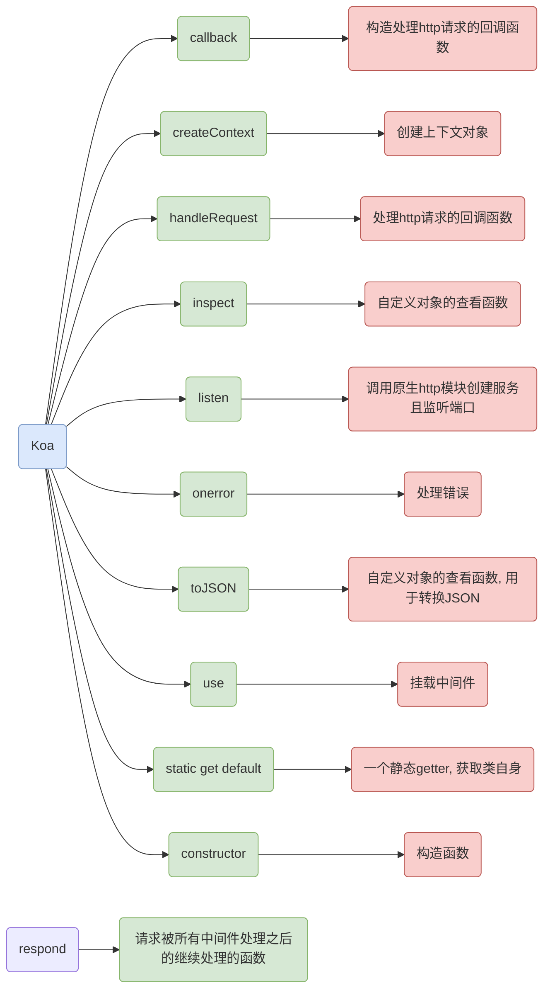
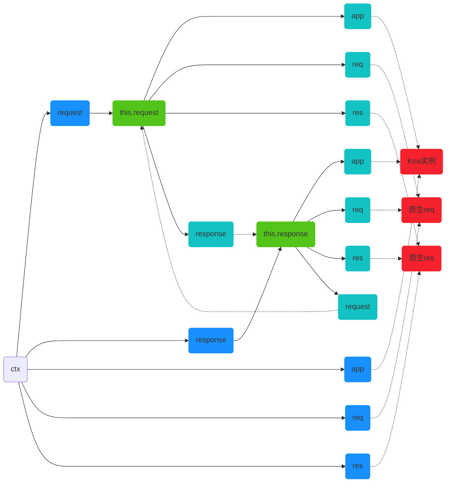

就像官网所言：Koa -- 基于 Node.js 平台的下一代 web 开发框架，在了解它之前我们先看下一个简单的栗子

```js
const http = require('http')

http.createServer((request, response) => {
    response.end('Hello world!')
}).listen(3000)
```

一个再也简单不过的栗子，执行之后访问`http://localhost:3000/`可见页面

就是使用`http`模块创建服务器，且绑定`3000`端口，创建服务器传入的回调函数有俩参数`request、response`分别用于接收、响应请求，`Koa`就是在这个基础上实现的一个框架

作为一个框架自然不会这么简单，据`koa`源码结构来看分为四部分：`application、context、request、response`，结构清晰，接下来一一分解

# Application

首先梳理下该文件内的函数，其实也不复杂，就一个`Koa`类、`respond`方法



```js
module.exports = class Application extends Emitter {
    // ...
}


function respond(ctx) {
    // ...
}
```

可见构造很简单，值得注意的是`Koa`继承了`Emitter`，这个用于捕获错误

## constructor

看类先从构造函数起

```js
constructor(options) {
    super();
    options = options || {};
    // 是否开启代理意思，为真的话对于获取request中的ip、host等会从X-Forwarded-For、X-Forwarded-Host中取
    this.proxy = options.proxy || false;
    // 子域名的偏移量，这个决定了request.subdomains的返回结果
    this.subdomainOffset = options.subdomainOffset || 2;
    // 就是代理ip消息头
    this.proxyIpHeader = options.proxyIpHeader || 'X-Forwarded-For';
    // 就是获取ips的最大量，注意是从后往前，2的话就是从后往前俩个
    this.maxIpsCount = options.maxIpsCount || 0;
    // node执行环境
    this.env = options.env || process.env.NODE_ENV || 'development';
    // 加密cookies的keys
    if (options.keys) this.keys = options.keys;
    // 存放中间件
    this.middleware = [];
    // 上下文副本
    this.context = Object.create(context);
    // 请求对象副本
    this.request = Object.create(request);
    // 返回对象副本
    this.response = Object.create(response);
    // util.inspect.custom support for node 6+
    /* istanbul ignore else */
    // 用于将对象转换为字符串，自定义转换逻辑
    if (util.inspect.custom) {
        this[util.inspect.custom] = this.inspect;
    }
}
```

大致上看注释即可，挑几个讲下：

+ proxy：这个默认`false`，开启的话我们获取`request`的`ip\protocol\host`就得从`X-Forwarded-xxx`上获取，这些信息头可以[从此查询](https://developer.mozilla.org/zh-CN/docs/Web/HTTP/Headers/X-Forwarded-Host)

+ maxIpsCount：从请求头获取的`ip`可能是多个的，这样子我们可以根据这个值来从后往前取部分`ip`，从后往前呢是因为得取下游的

+ keys：这个就是`cookies`这个第三方库所需的`options.keys`

+ util.inspect.custom：这个其实就是**自定义对象的查看函数**

  ```js
  const util = require('util');
  
  class Password {
      constructor(value) {
          this.value = value
          if (util.inspect.custom) {
              this[util.inspect.custom] = this.inspect
          }
      }
  
      inspect() {
          return 'inspect'
      }
  }
  
  const pwd = new Password('123456')
  
  console.log(pwd)  // inspect
  // 一些查询链接
  // http://nodejs.cn/api/util/util_inspect_custom.html
  // http://caibaojian.com/nodejs/s/e79zaZ.html#util_util_inspect_custom
  // http://caibaojian.com/nodejs/s/e79zaZ.html#util_custom_inspection_functions_on_objects
  ```

## use

方法还是很简单的，接收一个函数类型参数`fn`，存入`middleware`

值得注意的是若`fn`是`generator`类型就做层转化，且做个提醒，因为`v3`不再支持`generator`

  ```js
  use(fn) {
      if (typeof fn !== 'function') throw new TypeError('middleware must be a function!');
      if (isGeneratorFunction(fn)) {
          deprecate('Support for generators will be removed in v3. ' +
              'See the documentation for examples of how to convert old middleware ' +
              'https://github.com/koajs/koa/blob/master/docs/migration.md');
          fn = convert(fn);
      }
      debug('use %s', fn._name || fn.name || '-');
      this.middleware.push(fn);
      return this;
  }
  ```

  ## listen

这个就是创建且绑定端口，俱是调用`http`原生模块

```js
listen(...args) {
    debug('listen');
    const server = http.createServer(this.callback());
    return server.listen(...args);
}
```

## callback、handleRequest

这个其实就是构建处理请求的回调函数

```js
callback() {
    const fn = compose(this.middleware);

    if (!this.listenerCount('error')) this.on('error', this.onerror);

    const handleRequest = (req, res) => {
        const ctx = this.createContext(req, res);
        return this.handleRequest(ctx, fn);
    };

    return handleRequest;
}
```

首先就是调用`koa-compose`模块将传入的中间件数组合并为一个函数

然后调用继承自`Emitter`的`listenerCount`方法，查看正在监听的`error`事件的监听器的数量，若是为空就监听`error`，注意这里的`onerror`是本类定义的

最后返回`handleRequest`这个局部函数，**它就是真正的处理请求的回调函数**，内部创建上下文对象、以及调用`handleRequest`来处理中间件

```js
handleRequest(ctx, fnMiddleware) {
    const res = ctx.res;
    res.statusCode = 404;
    const onerror = err => ctx.onerror(err);
    const handleResponse = () => respond(ctx);
    onFinished(res, onerror);
    return fnMiddleware(ctx).then(handleResponse).catch(onerror);
}
```

这里首先默认`statusCode`为`404`，然后调用`on-finished`模块对`res`进行监听，若是失败或者报错就调用`onerror`处理，值得注意的是这里的`onerror`是在`context.js`定义的

最后就是执行传入的`fnMiddleware`，若是全部执行无异常则调用`handleResponse`进行最后处理，有异常则调用`onerror`处理

## createContext

这个其实是为了方便取值，做了一系列的处理，让人觉得很绕

```js
createContext(req, res) {
    const context = Object.create(this.context);
    const request = context.request = Object.create(this.request);
    const response = context.response = Object.create(this.response);
    context.app = request.app = response.app = this;
    context.req = request.req = response.req = req;
    context.res = request.res = response.res = res;
    request.ctx = response.ctx = context;
    request.response = response;
    response.request = request;
    context.originalUrl = request.originalUrl = req.url;
    context.state = {};
    return context;
}
```




就是让你通过`ctx`可以很方便的获取这么些对象、属性

## onerror

```js
onerror(err) {
    // When dealing with cross-globals a normal `instanceof` check doesn't work properly.
    // See https://github.com/koajs/koa/issues/1466
    // We can probably remove it once jest fixes https://github.com/facebook/jest/issues/2549.
    const isNativeError =
        Object.prototype.toString.call(err) === '[object Error]' ||
        err instanceof Error;
    if (!isNativeError) throw new TypeError(util.format('non-error thrown: %j', err));

    if (404 === err.status || err.expose) return;
    if (this.silent) return;

    const msg = err.stack || err.toString();
    console.error(`\n${msg.replace(/^/gm, '  ')}\n`);
}
```

就是简单的错误打印

## respond

这个其实是内置的自动处理响应的函数，主要是处理`ctx.body`，若是不需要自动处理就置`ctx.respond = false`即可

若是响应不可写自然也是不需要处理了

```js
function respond(ctx) {
    // allow bypassing koa
    if (false === ctx.respond) return;

    if (!ctx.writable) return;

    const res = ctx.res;
    let body = ctx.body;
    const code = ctx.status;

    // ignore body
  	// 根据statusCode来判断是否需要处理ctx.body
    if (statuses.empty[code]) {
        // strip headers
        ctx.body = null;
        return res.end();
    }
		// 
    if ('HEAD' === ctx.method) {
        if (!res.headersSent && !ctx.response.has('Content-Length')) {
            const { length } = ctx.response;
            if (Number.isInteger(length)) ctx.length = length;
        }
        return res.end();
    }

    // status body
    if (null == body) {
      	// _explicitNullBody为真说明有显示设置ctx.body === null了，移除俩消息头，直接响应即可
        if (ctx.response._explicitNullBody) {
            ctx.response.remove('Content-Type');
            ctx.response.remove('Transfer-Encoding');
            return res.end();
        }
      	// http版本>=2
        if (ctx.req.httpVersionMajor >= 2) {
            body = String(code);
        } else {
            body = ctx.message || String(code);
        }
      	//  未发送响应头，则为 false
        if (!res.headersSent) {
            ctx.type = 'text';
          	// 返回字节长度
            ctx.length = Buffer.byteLength(body);
        }
        return res.end(body);
    }

    // responses
    // 根据body的类型来具体处理
    if (Buffer.isBuffer(body)) return res.end(body);
    if ('string' === typeof body) return res.end(body);
    if (body instanceof Stream) return body.pipe(res);
		
    // body: json
  	// 转成字符串
    body = JSON.stringify(body);
    if (!res.headersSent) {
        ctx.length = Buffer.byteLength(body);
    }
    res.end(body);
}
```

# request

+ header：原生`req`的`headers`
+ headers：同上
+ url：`/attendance/manage/rule/search?r=1610710798704&code=275302`
+ origin：`http://10.242.240.218:8080`
+ href：`http://10.242.240.218:8080/attendance/manage/rule/search?r=1610710798704&code=275302`
+ method：`GET`
+ path：`/attendance/manage/rule/search`
+ query：`{ code: "275302", r: "1610710798704" }`
+ querystring：`r=1610710798704&code=275302`
+ search：`?r=1610710798704&code=275302`
+ host：`10.242.240.218:8080`
+ hostname：`10.242.240.218`
+ URL：`URL`对象
+ fresh：判断缓存是否新鲜，只针对`HEAD\GET`
+ stale：`fresh`取反
+ idempotent：判断是否是`'GET', 'HEAD', 'PUT', 'DELETE', 'OPTIONS', 'TRACE'`
+ socket：原生`req.scoket`
+ charset：请求字符集
+ length：请求头的`Content-Length`
+ protocol：返回请求的协议
+ secure：判断是否是`https`
+ ips：`app.proxy`启用，且`X-Forwarded-For`有值，返回请求的`ip`列表，从上游到下游排列
+ ip：请求的上游第一个`ip`
+ subdomains：子域数组，如：`[242, 10]`
+ accept：调用`accepts`第三方库来解析请求头信息，返回一个解析好的对象
+ accepts：其实就是`.accept.types(...args)`，检查给定的参数是否匹配，如果匹配上就返回最佳匹配，传参如`.accept.types('text/html') === 'text/html'`
+ acceptsEncodings：类似`accepts`，返回`accept-encoding`的最佳匹配
+ acceptsCharsets：`accept-language`
+ acceptsLanguages：`charset`
+ is：就是调用第三方库[type-is](https://www.npmjs.com/package/type-is)来检查`content-type`请求头是否匹配传入的参数
+ type：获取`Content-Type`
+ get：获取请求头的字段，比如`.get('host')`
+ inspect：自定义对象的查看函数
+ toJSON：自定义对象的查看函数

# response

+ socket：原生的`res.socket`
+ header：通过原生`res`获取响应头
+ headers：同上
+ status：`res.statusCode`，响应状态码
+ message：响应状态信息
+ body：响应主体
+ length：`Content-Length`，使用`Buffer.byteLength`对`body`进行计算的结果
+ headerSent：判断是否已经发送过了响应头
+ vary：这个就是对`Vary`这个头部的处理，[可见于此](https://zhuanlan.zhihu.com/p/47049060)、[或此](https://imququ.com/post/vary-header-in-http.html)
+ redirect：就是执行重定向，并且设置下状态码、`Content-Type`、`body`等
+ attachment：就是设置附件提醒客户端下载
+ type：设置`Content-Type`
+ lastModified：`Last-Modified`
+ etag：`ETag`
+ is：就是调用第三方库[type-is](https://www.npmjs.com/package/type-is)来检查`content-type`请求头是否匹配传入的参数
+ get：返回指定的响应头部
+ has：判断指定的头部是否存在
+ set：设置响应头部
+ append：设置额外的头部
+ remove：删除指定的响应头
+ writable：判断响应是否可写
+ inspect：自定义对象查看函数
+ toJSON：自定义对象查看函数
+ flushHeaders：刷新响应头，一般而言在`.end`调用或者写入第一个请求数据块之前都不会发送数据，会缓冲请求头，这个方法可以绕过这个优化

# context

就是`ctx`的原型对象，结构也很简单

```js
const proto = module.exports = {
    inspect() {
        if (this === proto) return this;
        return this.toJSON();
    },

    toJSON() {
        return {
            request: this.request.toJSON(),
            response: this.response.toJSON(),
            app: this.app.toJSON(),
            originalUrl: this.originalUrl,
            req: '<original node req>',
            res: '<original node res>',
            socket: '<original node socket>'
        };
    },

    assert: httpAssert,

    throw(...args) {
        throw createError(...args);
    },

    onerror(err) {
        // ...
    },

    get cookies() {
        if (!this[COOKIES]) {
            this[COOKIES] = new Cookies(this.req, this.res, {
                keys: this.app.keys,
                secure: this.request.secure
            });
        }
        return this[COOKIES];
    },

    set cookies(_cookies) {
        this[COOKIES] = _cookies;
    }
};
delegate(proto, 'response')
    .method('attachment')
  	// ...

delegate(proto, 'request')
    .method('acceptsLanguages')
    .method('acceptsEncodings')
  	// ...
```

`delegate`就是让`proto.response.attachment === proto.attachment`，类似这种代理

## cookies

这个就是调用`cookies`第三方库创建的一个方便处理`Cookie`的对象，具体使用看该库就可以了

## throw

这个就是调用`http-errors`第三方库来很方便的构建一个和`statusCode`相匹配的错误，就如`ctx.throw(404) ~= { error: { message: 'Not Found', status: 404, statusCode: 404, name: 'NotFoundError'} }`

## onerror

```js
onerror(err) {
    // 没有错误的话自然是不要继续了
    if (null == err) return;

    // When dealing with cross-globals a normal `instanceof` check doesn't work properly.
    // See https://github.com/koajs/koa/issues/1466
    // We can probably remove it once jest fixes https://github.com/facebook/jest/issues/2549.
    // 这里有个问题就是判定error，使用toString就保险了
    const isNativeError =
        Object.prototype.toString.call(err) === '[object Error]' ||
        err instanceof Error;
    if (!isNativeError) err = new Error(util.format('non-error thrown: %j', err));

    // 这个就是看看响应是否已经发了或者不可写
    let headerSent = false;
    if (this.headerSent || !this.writable) {
        headerSent = err.headerSent = true;
    }

    // delegate
    // 触发一下错误监听，打印下日志
    this.app.emit('error', err, this);

    // nothing we can do here other
    // than delegate to the app-level
    // handler and log.
    // 响应已经发了或者不可写那之后自然就无需处理了，处理了也没用
    if (headerSent) {
        return;
    }

    const { res } = this;

    // first unset all headers
    /* istanbul ignore else */
    // 既然都有错误了自然把所有已经设置的响应头都移除
    if (typeof res.getHeaderNames === 'function') {
        res.getHeaderNames().forEach(name => res.removeHeader(name));
    } else {
        res._headers = {}; // Node < 7.7
    }

    // then set those specified
    // 根据错误设置响应头
    this.set(err.headers);

    // force text/plain
    // 错误Content-Type自然是text
    this.type = 'text';
    
    let statusCode = err.status || err.statusCode;

    // ENOENT support
    // 找不见文件就设置404
    if ('ENOENT' === err.code) statusCode = 404;

    // default to 500
    // 识别不出的错误就默认500
    if ('number' !== typeof statusCode || !statuses[statusCode]) statusCode = 500;

    // respond
    const code = statuses[statusCode];
    // 错误需要暴露的话就返回详细信息message，否则就code
    const msg = err.expose ? err.message : code;
    this.status = err.status = statusCode;
    this.length = Buffer.byteLength(msg);
    res.end(msg);
}
```

# npm包

相关的一些`npm`库

## statuses

这个就是处理`statusCode`的一个库，代码很简单，看`npm`章节

## koa-compose

这个就是`koa`中间件组装

```js
'use strict'

/**
 * Expose compositor.
 */

module.exports = compose

/**
 * Compose `middleware` returning
 * a fully valid middleware comprised
 * of all those which are passed.
 *
 * @param {Array} middleware  传入的函数数组
 * @return {Function}
 * @api public
 */

function compose(middleware) {
    // 简单的参数校验
    if (!Array.isArray(middleware)) throw new TypeError('Middleware stack must be an array!')
    for (const fn of middleware) {
        if (typeof fn !== 'function') throw new TypeError('Middleware must be composed of functions!')
    }

    /**
     * @param {Object} context
     * @return {Promise}
     * @api public
     */
    // 返回一个匿名函数，就是handleRequest里的fnMiddleware(ctx).then(handleResponse).catch(onerror)的fnMiddleware
    // next就是下一个待执行的中间件函数
    return function (context, next) {
        // last called middleware #
      	// 这个标志位，用于记录最后一次执行的中间件索引
        let index = -1
        return dispatch(0)
        function dispatch(i) {
          	// 试想，若是next多次调用时，那么index肯定是middleware.length了，肯定是>=i的
            if (i <= index) return Promise.reject(new Error('next() called multiple times'))
            index = i
            // 获取当前需执行的中间件函数
            let fn = middleware[i]
            // 这里做了个处理就是到了中间件最后一项溢出了，取不到函数，这时候将其设置为next
            // 也就是没有这个处理也是undefined，但是有了这个处理可以指定最后一个操作，相当于一个after钩子
            if (i === middleware.length) fn = next
            // 做个判空处理
            if (!fn) return Promise.resolve()
            // 因为不知道中间件逻辑，所以try/catch包裹下
            try {
                // 这里递归调用自己，注意调用dispatch的.bind以及游标递增
                // 得返回Promise
                return Promise.resolve(fn(context, dispatch.bind(null, i + 1)));
            } catch (err) {
                // 直接Promise.reject
                return Promise.reject(err)
            }
        }
    }
}
```

代码很简单，它的洋葱模型也是如此


看源码递归调用`dispatch`执行，在回溯前就是`Request`深入洋葱心得过程

然后就是递归回溯，这就是`Response`出来的过程

中间件里根据`next`来控制调用下一个中间件，并且返回的是`Promise`，这样子就可以使用`await next`

```js
app.use(async (ctx, next) => {
    ctx.body = '1 start'
    console.log(ctx.body)
    const nextData = await next()
    console.log(nextData)
    ctx.body = '1 end'
    console.log(ctx.body)
}).use(async function fn(ctx, next) {
    ctx.body = '2 start'
    console.log(ctx.body)
    await next()
    ctx.body = '2 end'
    return new Promise((resolve, reject) => {
        setTimeout(
            () => resolve(ctx.body),
            5000
        )
    })
})
```

就像此例，回溯前正常打印

```shell
1 start
2 start
```

这个很好理解，不再解释

接下来得说下回溯过程

`next`，这个其实就是指代下一个中间件，`const nextData = await next()`就像这个其实就是指代第二个中间件函数（实际上是`dispatch`），也就是相当于如下所示

```js
const nextData = await next()
// <==>
const nextData = await Promise.resolve(new Promise((resolve, reject) => {
        setTimeout(
            () => resolve(ctx.body),
            5000
        )
    })
})
```

所以接下来就是打印

```shell
2 end
1 end
```

