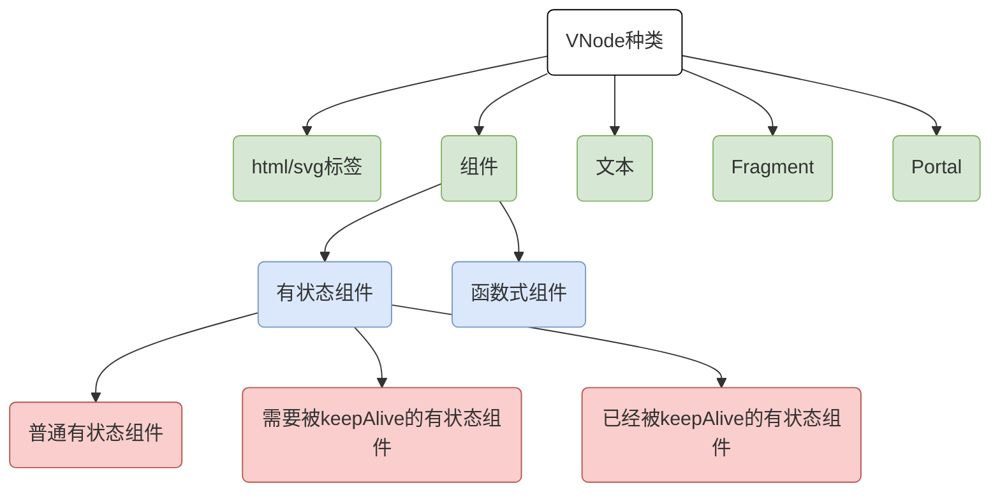

组件产出是`VNode`，那么设计它自然就是最重要的了

# 真实的`DOM`

这个就是真实`DOM`的一些见得到的属性，就像标签名、事件、样式、子节点等等

其实这样子也很简单的可以表现出来

```js
const elementVNode = {
    tag: 'div',
    data: {
        style: {
            width: '100px',
            height: '100px',
            backgroundColor: 'red'
        }
    }, children: [
        {
            tag: 'h1',
            data: null
        },
        {
            tag: 'p',
            data: null
        }
    ]
}
```

文本节点的话就可以如下表示

```js
const textVNode = {
    tag: null,
    data: null,
    children: null,
    text: '文本内容'
}
// or
const textVNode = {
    tag: 'div',
    data: null,
    children: '文本内容'
}
```

总归就是语义说得通，轻量好用就行

# 抽象的`DOM`

## 组件

首先自然是组件了，就像下面这段模板

```html
<div>
  	<hello />
</div>
```

我们肯定不是想要渲染`hello`这么个标签，而是想渲染它的产出那我们就得有办法在挂载的时候根据`VNode`来判断这个是组件不是

其实这个我们想想普通的节点是怎么创建的就知道了，就像`div`，那就是`document.createElement('div')`，也就是根据`tag`得知道怎么创建一个节点，所以我们若是组件那自然就是我们自定义的组件函数（类），如下

```js
const componentVNode = {
    tag: HelloComponent,
    data: null
}
```

这样子我们可以通过`tag`来判断该节点是组件还是普通标签，也可以根据它来创建该组件节点

## Fragment

假如我们有以下模板

```html
<ul>
  	<Columns />
</ul>
```

`Columns`组件模板如下，这在`Vue2.x`可是不能这么写的

```html
<template>
		<li></li>
  	<li></li>
</template>
```

那么这个`VNode`怎么表示呢？其实我们得给它一个抽象的根节点就行了，这就是`Fragment`

```js
const Fragment = Symbol()
const fragmentVNode = {
  	tag: Fragment,
  	data: null,
  	children: [{
      	tag: 'li',
      	data: null
    }, {
      	tag: 'li',
      	data: null
    }]
}
```

这样子渲染的时候发现是个`Fragment`节点就说明渲染它的子节点就行了

## Portal

这个其实就是可以把你的内容渲染到任意地方。就像你要整个蒙版，我们一般是渲染到该页面的最外层，然后通过`CSS`来控制位置。不过要是这个组件是嵌套的，且是内层，那么实际位置还是很底层，这样子可能会被外层元素影响。要是我们可以随意控制它的渲染位置就行了，这个其实就是个简单的内置组件

```html
<template>
    <Portal target="#app-root">
      	<div></div>
    </Portal>
</template>
```

其实我们自己也可以封装一个这样子的组件

```js
const Portal = Symbol()
const portalVNode = {
  	tag: Portal,
  	data: {
      	target: '#app-root'
    },
  	children: [{
      	tag: 'div',
      	data: null
    }]
}
```

可见和`Fragment`还是很像的

# `VNode`的`flags`标识

我们回想下`Vue2.x`是怎么判断组件的：

1. 首先把它当做组件去处理，要是成功了就是组件
2. 不是的话就看下`tag`，有值的就是普通标签了
3. 没值的话就是文本或者注释

这都是我们拿到了`VNode`，在`patch`时走的逻辑，**这样子就不能在预编译（Ahead-Of-Time）做优化了、开发者也不能手动优化**

其实我们完全可以在创建`VNode`的时候就把这类型判断好，这就是给`VNode`加个`flags`属性
## VNode种类



## VNodeFlags

我们可以整个对象去表示这么些个种类：

```js
const VNodeFlags = {
    // html 标签
    ELEMENT_HTML: 1,
    // SVG 标签
    ELEMENT_SVG: 1 << 1,

    // 普通有状态组件
    COMPONENT_STATEFUL_NORMAL: 1 << 2,
    // 需要被keepAlive的有状态组件
    COMPONENT_STATEFUL_SHOULD_KEEP_ALIVE: 1 << 3,
    // 已经被keepAlive的有状态组件
    COMPONENT_STATEFUL_KEPT_ALIVE: 1 << 4,
    // 函数式组件
    COMPONENT_FUNCTIONAL: 1 << 5,

    // 纯文本
    TEXT: 1 << 6,
    // Fragment
    FRAGMENT: 1 << 7,
    // Portal
    PORTAL: 1 << 8
}
```

| VNodeFlags                           | 表达式 |  32位`bit`  |
| :----------------------------------- | :----: | :---------: |
| ELEMENT_HTML                         |   1    | 00000000`1` |
| ELEMENT_SVG                          | 1 << 1 | 0000000`1`0 |
| COMPONENT_STATEFUL_NORMAL            | 1 << 2 | 000000`1`00 |
| COMPONENT_STATEFUL_SHOULD_KEEP_ALIVE | 1 << 3 | 00000`1`000 |
| COMPONENT_STATEFUL_KEPT_ALIVE        | 1 << 4 | 0000`1`0000 |
| COMPONENT_FUNCTIONAL                 | 1 << 5 | 000`1`00000 |
| TEXT                                 | 1 << 6 | 00`1`000000 |
| FRAGMENT                             | 1 << 7 | 0`1`0000000 |
| PORTAL                               | 1 << 8 | `1`00000000 |

根据这张表我们还能衍生出以下几个种类

```js
// 标签元素
VNodeFlags.ELEMENT = VNodeFlags.ELEMENT_HTML | VNodeFlags.ELEMENT_SVG
// 有状态组件
VNodeFlags.COMPONENT_STATEFUL =
    VNodeFlags.COMPONENT_STATEFUL_NORMAL |
    VNodeFlags.COMPONENT_STATEFUL_SHOULD_KEEP_ALIVE |
    VNodeFlags.COMPONENT_STATEFUL_KEPT_ALIVE
// 组件
VNodeFlags.COMPONENT = VNodeFlags.COMPONENT_STATEFUL | VNodeFlags.COMPONENT_FUNCTIONAL
```

| VNodeFlags         | 32位`bit`            |
| ------------------ | -------------------- |
| ELEMENT            | 0000000`1` `1`       |
| COMPONENT_STATEFUL | 0000`1` `1` `1`00    |
| COMPONENT          | 000`1` `1` `1` `1`00 |

> 这样子我们就可以用按位与运算来判断一个`VNode`是不是组件、标签元素、有状态组件
>
> `VNodeFlags.TEXT & VNodeFlags.ELEMENT  == 000000000`，这自然就是假的了，只有`ELEMENT_HTML、ELEMENT_SVG`才能得到真值

## ChildrenFlags

