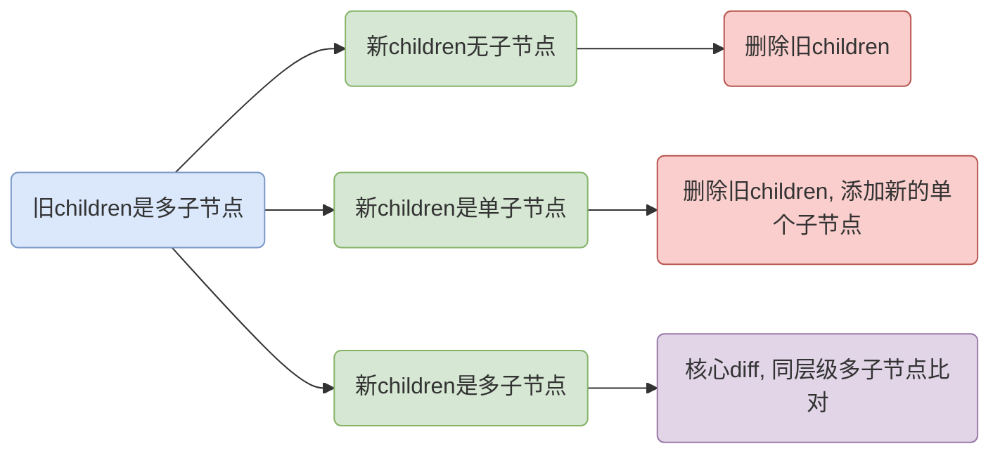

上一章节可知核心就是多个同层级的子节点`diff`

# 粗暴`diff`算法



之前的`patch`我们知道分九种情况，其中八种都是很好处理的，唯独有一种很麻烦，那就是图中所示的核心`diff`，我们之前采用的是简单粗暴的**移除所有旧节点，添加所有新节点**，如下所示

```js
function patchChildren(
    prevChildFlags,
    nextChildFlags,
    prevChildren,
    nextChildren,
    container
) {
    switch (prevChildFlags) {
        // ....

        // 旧children有多个子节点
        default:
            switch (nextChildFlags) {
                case ChildrenFlags.SINGLE_VNODE:
                // ...
                case ChildrenFlags.NO_CHILDREN:
                // ...
                default:
                    // 新的 children 中有多个子节点
                    prevChildren.forEach(element => {
                        container.removeChild(element)
                    })
                    nextChildren.forEach(element => {
                        mount(element, container)
                    })
            }
    }
}
```

举个很经典的栗子

```html
<ul>
  	<li>1</li>
  	<li>2</li>
  	<li>3</li>
</ul>

<ul>
  	<li>3</li>
  	<li>1</li>
  	<li>2</li>
</ul>
```

这个要是改变了顺序按照该算法得先把旧的全部删掉，然后重新创建这三个新的节点，操作如下图所示：


但是这个很显然并不是我们想要的，毕竟移除、创建是很耗性能的，我们其实可以有更好的选择

# 简单算法

还是上面那个例子，我们也看见新的只是改了文案而已，标签都没换，我们其实完全可以遍历节点，然后比对新旧节点，因为标签没变所以只是`children、VNodeData`可能有变，节点本身是不会重新创建或者删除的


如图所示，我们遍历比对新旧节点即可，若是有有新增节点就直接创建新节点即可，反之若是有多余的旧节点则直接删除即可，根据这个思路我们可以很简单的写出代码

```js
function patchChildren(
    prevChildFlags,
    nextChildFlags,
    prevChildren,
    nextChildren,
    container
) {
    switch (prevChildFlags) {
        // ....

        // 旧children有多个子节点
        default:
            switch (nextChildFlags) {
                case ChildrenFlags.SINGLE_VNODE:
                // ...
                case ChildrenFlags.NO_CHILDREN:
                // ...
                default:
                    const prevLen = prevChildren.length
                    const nextLen = nextChildren.length
                    const commonLen = Math.min(prevLen, nextLen)
                    for (let i = 0; i < commonLen; i++) {
                        patch(prevChildren[i], nextChildren[i], container)
                    }
                    // 有新增的新元素
                    if (nextLen > prevLen) {
                        for (let i = commonLen; i < nextLen; i++) {
                            mount(nextChildren[i], container)
                        }
                    }
                    // 有多余的的旧元素
                    if (prevLen > commonLen) {
                        for (let i = commonLen; i < prevLen; i++) {
                            container.removeChild(prevChildren[i].el)
                        }
                    }
            }
    }
}
```

# React 算法

还是上面那个例子，我们列下它们的`vnode`

```js
// old children
[
    h('li', null, 1),
    h('li', null, 2),
    h('li', null, 3)
]
// new children
[
    h('li', null, 3),
    h('li', null, 1),
    h('li', null, 2)
]
```

## 为什么需要`key`？

我们回顾下**简单算法**，首先新旧第一次循环`patch`

```js
h('li', null, 1)
// vs
h('li', null, 3)
```

这个会走`patchText`来更新，之后的每一次都是如此，但是其实我们可以一眼看出这不是最优解，很明显把`3`节点移动到`1`节点之前才是最优解


**其实通过这个前后你是看不出来它们是经过了什么变化的，你说是改变了顺序？其实人家只是依次改了文案；你说人家改了文案？人家可能只是变换了顺序**

当然，我们也可以看见它们都是没有`VNodeData`的，也就是唯一的区别就是`children`，**我们完全可以往最简单的方向考虑，那就是顺序改变了**


现在我们的任务就是找到需要移动的元素节点移动它们即可，但是在这之前有个很重要的事情就是我们根本没办法知道新旧节点们的对应关系，这就是刚刚提到的问题，你根本不知道它们是顺序变了还是依次改了文案，**你觉得它们只是变了顺序完全是因为你把`1、2、3`这个子节点文本当做标识了，可惜它是`VNodeData`，可变的，不能当做标识**，我们得有个**不可变的标识**来标识节点，所以我们引入了`key`，其实就是我们`Vue`列表里必须设定的`:key`

```js
// 旧 children
[
    h('li', { key: 'a' }, 'a'),
    h('li', { key: 'b' }, 'b'),
    h('li', { key: 'c' }, 'c')
]
// 新 children
[
    h('li', { key: 'c' }, 'c'),
    h('li', { key: 'b' }, 'b'),
    h('li', { key: 'a' }, 'a')
]
```


这样子就可以通过`key`来找见可复用的节点了，如下所示：


代码实现如下：
```js
function patchChildren(
    prevChildFlags,
    nextChildFlags,
    prevChildren,
    nextChildren,
    container
) {
    switch (prevChildFlags) {
        // ....

        // 旧children有多个子节点
        default:
            switch (nextChildFlags) {
                case ChildrenFlags.SINGLE_VNODE:
                // ...
                case ChildrenFlags.NO_CHILDREN:
                // ...
                default:
                    for (let i = 0; i < nextChildren.length; i++) {
                        const nextVNode = nextChildren[i]
                        for (let j = 0; j < prevChildren.length; j++) {
                            const prevVNode = prevChildren[j]
                            if (nextVNode.key === prevVNode.key) {
                                patch(prevVNode, nextVNode, container)
                                break
                            }
                        }
                    }
            }
    }
}

```
> 复用的是节点本身，因为创建、删除它最耗性能，它上面的数据都是可以比对更新的

## 找到需移动的节点

刚刚我们已经更新了对应节点的数据，现在还得移动节点，我们先看看怎么判断哪些节点需要移动


如图所示，我们一眼就可以看出`a、c`需要移动，但是你是怎么判断的呢？我们得把自己在计算机的角度看问题就很简单了，我们说的移动肯定得有个的基点，很显然我们把`b`当做基点，这样子相对于`b`而言只有`d`的位置是对的，我们就可以判定`a、c`需要移动，**其实就是找到以新首节点为起点，在旧`children`里最长递增的列表，然后其它节点对于该列表自然都是需要移动的了**

我们以此例走下这个算法，我们遍历新`children`，且在旧`children`找它对应的节点：

1. 首先是`b`，它是首位，所以不动，**确定了`b`的位置**，这时候我们记下`b`的索引（1），也就是当前基点是`b`
2. 第二次循环是`d`，它的索引是`3`，比`2`大，也就是相对基点`b`而言是递增的（我们遍历也是递增遍历），所以`d`的位置没问题，**确定了`bd`的位置**，**注意此时基点换成了`d`了，因为此时递增列表是`bd`**
3. 第三次循环是`c`，它的索引是`2`，比`3`小，也就是需要移动了，**注意此时基点不换，因为此时递增序列还是`bd`**，其实之后也不会换了
4. 第四次循环是`a`，它的索引是`0`，相对`bd`而言自然也是需要移动的

代码实现如下：

```js
function patchChildren(
    prevChildFlags,
    nextChildFlags,
    prevChildren,
    nextChildren,
    container
) {
    switch (prevChildFlags) {
        // ....

        // 旧children有多个子节点
        default:
            switch (nextChildFlags) {
                case ChildrenFlags.SINGLE_VNODE:
                // ...
                case ChildrenFlags.NO_CHILDREN:
                // ...
                default:
                    let basicPointIndex = 0
                    for (let i = 0; i < nextChildren.length; i++) {
                        const nextVNode = nextChildren[i]
                        for (let j = 0; j < prevChildren.length; j++) {
                            const prevVNode = prevChildren[j]
                            if (nextVNode.key === prevVNode.key) {
                                patch(prevVNode, nextVNode, container)
                                if (j < basicPointIndex) {
                                    // 需要移动
                                } else {
                                    basicPointIndex = j
                                }
                                break
                            }
                        }
                    }
            }
    }
}
```

> 关键就是这个`basicPointIndex`，它存的是这个递增列表的末节点的索引

## 移动节点

首先我们得知道一个前提，**`patch`之后复用了`el`**


如图所示，`c`节点`patch`之后`nextVNode.el === prevVNode.el`，这个其实有大用


按照刚刚的分析我们操作应该如图所示，我们分析下步骤：

1. 遍历到`c`，`patch`操作之后新的`c`节点有了真实`dom`的引用，因为是首个所以位置不动，此时递增序列为`[c]`，基点索引`2`，真实节点顺序是`[abc]`
2. 遍历到`b`，找见`b`的旧索引`1 < 2`，需要移动，移动的位置必然是在新`children`里找，也就是`b`在`c`之后。因为没有`insertAfter`所以我们插入的点就是`c`真实节点后面节点的前面。如图，`c`真实节点后面啥都没有，所以就是`b`移动到最后，此时递增序列不变，基点索引自然也不变，但是真实节点顺序已经是`[acb]`
3. 遍历到`a`，找见`a`的旧索引`0 < 2`，需要移动，移动到`b`后面，当前的真实节点顺序是`[acb]`，也就是移动到最后，自此移动完毕，顺序`[cba]`

代码实现如下:

```js
function patchChildren(
    prevChildFlags,
    nextChildFlags,
    prevChildren,
    nextChildren,
    container
) {
    switch (prevChildFlags) {
        // ....

        // 旧children有多个子节点
        default:
            switch (nextChildFlags) {
                case ChildrenFlags.SINGLE_VNODE:
                // ...
                case ChildrenFlags.NO_CHILDREN:
                // ...
                default:
                    let basicPointIndex = 0
                    for (let i = 0; i < nextChildren.length; i++) {
                        const nextVNode = nextChildren[i]
                        for (let j = 0; j < prevChildren.length; j++) {
                            const prevVNode = prevChildren[j]
                            if (nextVNode.key === prevVNode.key) {
                                patch(prevVNode, nextVNode, container)
                                if (j < basicPointIndex) {
                                    // i - 1，也就是上一个遍历的节点必然`patch`，已经持有.el的引用
                                    const refNode = nextChildren[i - 1].el.nextSibling
                                    // 以下俩个都行
                                    container.insertBefore(nextVNode.el, efNode)
                                    // container.insertBefore(prevVNode.el, efNode)
                                } else {
                                    basicPointIndex = j
                                }
                                break
                            }
                        }
                    }
            }
    }
}

```

## 移除多余节点

之前的情况其实有点完美了，也就是新旧节点个数一致，那么不一致呢？，首先是旧节点更多


如图所示，首先按照现有的逻辑移动完了之后节点情况是`[bac]`，我们需要把这个`c`给删除

```js
for (let i = 0; i < prevChildren.length; i++) {
    const prevVNode = prevChildren[i]
    if (!nextChildren.some(({ key }) => prevVNode.key === key)) {
        container.removeChild(prevVNode.el)
    }
}
```

如代码所示，我们需要遍历一次旧节点列表，删除掉那个在新节点里找不到对应的那个节点

## 添加新增节点


这个移动完了之后节点顺序是`[ba]`，还有个`c`节点需要被添加

我们在新`children`里可知道它是在`b`节点之后，我们现有的代码只处理了在旧`children`能找上匹配的情况，现在需要添加上找不见的情况，也就是新增的

```js
let basicPointIndex = 0
for (let i = 0; i < nextChildren.length; i++) {
    const nextVNode = nextChildren[i]
    let j = 0
    for (; j < prevChildren.length; j++) {
        const prevVNode = prevChildren[j]
        if (nextVNode.key === prevVNode.key) {
            patch(prevVNode, nextVNode, container)
            if (j < basicPointIndex) {
                // i - 1，也就是上一个遍历的节点必然`patch`，已经持有.el的引用
                const refNode = nextChildren[i - 1].el.nextSibling
                // 以下俩个都行
                container.insertBefore(nextVNode.el, efNode)
                // container.insertBefore(prevVNode.el, efNode)
            } else {
                basicPointIndex = j
            }
            break
        }
    }
    if (j === prevChildren.length) {
        const refNode = 
            i === 0
                ? prevChildren[0].el
                : nextChildren[i - 1].el.nextSibling
        mount(nextVNode, container, false, refNode)
    }
}
```

这里判断依据就是内层循环完了之后还没有找见的话`j === prevChildren.length`必然是成立的，此时找见`refNode`就行了，若是新`children`第一个就是待新增的，这个`refNode`就得插入当前真实节点最前面，否则就插入到上一个新节点后面


# Vue2.x 双端比较

`Vue2.x`采用的是`snabbdom`的双端比较算法

## 算法图解

### step1


如图所示，就是按照顺序一一比较，因为比较的对象节点是`children`俩端所以也叫双端比较

这个其实本质上和`React diff`算法是一样的，就是找到对应的节点然后进行适当的移动

它是俩端往中间遍历，每一次比对都会往中间靠近一分，直到其中某一方遍历完毕

图中第④条红线比较是找见了可复用的节点，也就是该节点在旧`children`是在末尾，但是在新`children`的首位，这就得移动了，得把该节点移动到当前列表（也就是旧`children`）首位

### step2


因为之前`d`节点已经处理了，所以`prevEndIdx、nextStartIdx`各自往中间移一位，也就是如今样子

这时候继续四步比较，图中第②条红线匹配上了，不过因为该节点`c`在新旧`children`的末尾，也就是它们位置是一样的，那么自然无需移动了，`patch`即可，当然别忘了更新`Idx`

### step3


匹配到第三步，也就是图中的`③`红线对应的`a`节点，得把`a`移到末尾，以及更新`Idx`

### step4


首先还是那四步比对，当然这里一进来比对上了，不过`b`节点在其列表里都是首位，自然也不用移动，这里更新`Idx`就按第一条规矩更新，也就是`prevStartIdx、nextStartIdx`各自往中间移一位

### step5


这最后一步就停止了，因为很明显新旧`children`都遍历完了

### 移除多余节点


如图所示，遍历完毕之后还剩下了`c`节点，这是个待删除的节点，但是我们怎么知道这个待删除的情况呢？其实很简单，我们发现这个循环结束是因为新`children`结束了，旧`children`还没有，这就可以根据索引来判定了

### 添加新增节点

新增节点分以下俩种情况


这种情况就是在旧节点没找见对应的，那么必然是新增的了，`mount`即可


这种情况就是遍历完成之后新`children`还剩下了未遍历的，那么必然也是新增的了

## 代码实现


首先我们定义四个变量来存储这四个节点的索引，四个变量来存储这四个节点

```js
let prevStartIdx = 0
let prevEndIdx = prevChildren.length - 1
let nextStartIdx = 0
let nextEndIdx = nextChildren.length - 1
let prevStartVNode = prevChildren[prevStartIdx]
let prevEndVNode = prevChildren[prevEndIdx]
let nextStartVNode = nextChildren[nextStartIdx]
let nextEndVNode = nextChildren[nextEndIdx]
```

这个遍历就不像上个算法一样双层遍历了，我们从`setp4`可以看出`children`遍历完毕之后`endIdx < startIdx`，在每一次的遍历都会执行图示的四步比对，那么就可以得出以下代码

```js
while (prevStartIdx <= prevEndIdx && nextStartIdx <= nextEndIdx) {
    if (prevStartVNode.key === nextStartVNode.key) {
        // ①
    } else if (prevEndVNode.key === nextEndVNode.key) {
        // ②
    } else if (prevStartVNode.key === nextEndVNode.key) {
        // ③
    } else if (prevEndVNode.key === nextStartVNode.key) {
        // ④
    } else {
        // 双端找不到
    }
}
```

接下来补充这四步的具体操作，我们按照上面图解的匹配步骤来补充

### step4

图解第一步匹配到的就是`④`，它的操作就是先`patch`，然后把`d`移到`a`前面，最后修改`Idx`

```js
if (prevEndVNode.key === nextStartVNode.key) {
    // ④
    patch(prevEndVNode, nextStartVNode, container)
    container.insertBefore(prevEndVNode.el, prevStartVNode.el)
    prevEndVNode = prevChildren[--prevEndIdx]
    nextStartVNode = nextChildren[++nextStartIdx]
}
```

### step2

图解第二步匹配到的是`②`，它就是`patch`了，并不移动，不过照常更新`Idx`

```js
if (prevEndVNode.key === nextEndVNode.key) {
    // ②
    patch(prevEndVNode, nextEndVNode, container)
    prevEndVNode = prevChildren[--prevEndIdx]
    nextEndVNode = nextChildren[--nextEndIdx]
}
```

### step3

图解第三步匹配到的是`③`，它就是先`patch`了，然后移动`a`节点到末尾，最后照常更新`Idx`

```js
if (prevStartVNode.key === nextEndVNode.key) {
    // ③
    patch(prevStartVNode, nextEndVNode, container)
    container.insertBefore(prevStartVNode.el, prevEndVNode.el.nextSibling)
    prevStartVNode = prevChildren[++prevStartIdx]
    nextEndVNode = nextChildren[--nextEndIdx]
}
```

### step1

图解第四步匹配到的是`①`，它就是`patch`了，并不移动，不过照常更新`Idx`

```js
if (prevStartVNode.key === nextStartVNode.key) {
    // ①
    patch(prevStartVNode, nextStartVNode, container)
    prevStartVNode = prevChildren[++prevStartIdx]
    nextStartVNode = nextChildren[++nextStartIdx]
}
```

### step5（双端找不到） 

这个就是双端都找不见的情况了，这也是大多数情况，这个就得去整个列表遍历查询了

```js
const idxInPrev = prevChildren.findIndex(
    ({ key }) => key === nextStartVNode.key
)
if (idxInPrev !== -1) {
    const vnodeToMove = prevChildren[idxInPrev]
    patch(vnodeToMove, nextStartVNode, container)
    prevChildren[idxInPrev] = undefined
    container.insertBefore(vnodeToMove.el, prevStartVNode.el)
}
nextStartVNode = nextChildren[++nextStartIdx]
```

这里关键得把已经移动的那个给置空，因为被移动的索引在之后的遍历范围之内，下次遍历到了就可以跳过

```js
while (prevStartIdx <= prevEndIdx && nextStartIdx <= nextEndIdx) {
    if (!prevStartVNode) {
        prevStartVNode = prevChildren[++prevStartIdx]
    } else if (!prevEndVNode) {
        prevEndVNode = prevChildren[--prevEndIdx]
    }
  	// ...
}
```

### 移除多余节点

这个如图解也是很容易写出代码

```js
if (prevStartIdx > prevEndIdx) {
    // do nothing
} else if (nextStartIdx > nextEndIdx) {
    // 到此说明新的遍历完毕，旧的还未
    for (let i = prevStartIdx; i <= prevEndIdx; i++) {
        container.removeChild(prevChildren[i].el)
    }
}
```

### 添加新增节点

图解我们可知分为遍历中、遍历后

#### 遍历中

```js
const idxInPrev = prevChildren.findIndex(
    ({ key }) => key === nextStartVNode.key
)
if (idxInPrev !== -1) {
    const vnodeToMove = prevChildren[idxInPrev]
    patch(vnodeToMove, nextStartVNode, container)
    prevChildren[idxInPrev] = undefined
    container.insertBefore(vnodeToMove.el, prevStartVNode.el)
} else {
    mount(nextStartVNode, container, false, prevStartVNode.el)
}
```

#### 遍历后

```js
if (prevStartIdx > prevEndIdx) {
    // 到此说明旧的的遍历完毕，新的的可能还未
    for (let i = nextStartIdx; i <= nextEndIdx; i++) {
        mount(nextChildren[i], container, false, prevStartVNode.el)
    }

} else if (nextStartIdx > nextEndIdx) {
    // 到此说明新的遍历完毕，旧的还未
    for (let i = prevStartIdx; i <= prevEndIdx; i++) {
        container.removeChild(prevChildren[i].el)
    }
}
```

> 我们可见插入的都在`prevStartVNode`之前，这是因为我们都是从俩端往中间遍历的，那么剩下来的必然得插入到中间，这个分界点呢自然就是已经遍历完毕的`prevStartVNode`这个节点了

## 双端比较优势

双端比较相比`React`的优势在于在移动`DOM`它不受`DOM`结构的影响

```js
旧children   a   b   c
新children   c   a   b
```

就像这个例子所示，我们要是使用`React diff`，那么就得移动`a、b`，但是使用双端比较的话就移动`c`即可

# Vue3.x 算法


