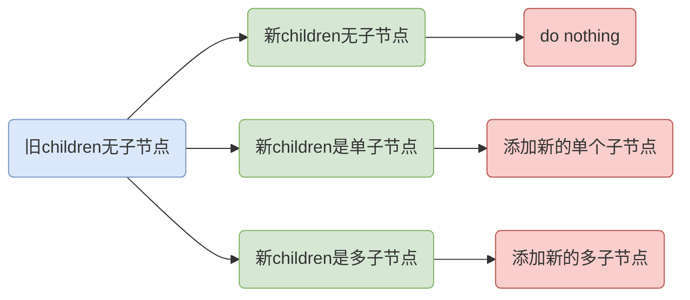
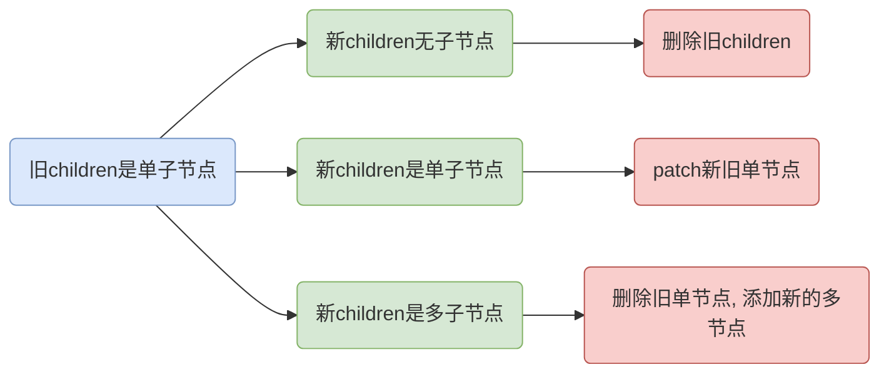
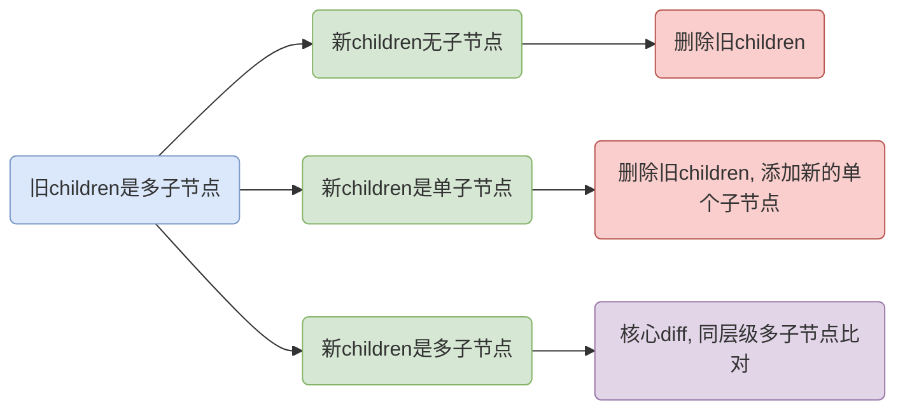

我们以`Vue`为例，整个页面其实有个根节点，算上其它子节点其实就是棵多叉树，这样子更新页面其实就是如何更新比对这个新旧多叉树了，这个时间复杂度是`O(n^3)`，肯定不能这么干，所以我们简化了下也就是**按照层级分解树**，只比对同层的（同个父节点），这样子时间复杂度接近`O(n)`

# 比对原则

为什么需要比对呢？就是为了避免**相同的俩个节点**因为重新创建删除而造成的性能浪费。关键就是相同类型，毕竟一个是`div`一个是文本节点，这俩个就没有`diff`的必要，直接替换就是了

这样子我们只要针对相同的类型`VNode`来编写`patchXXX`方法就是了

```js
function patch(prevVNode, nextVNode, container) {
    const prevFlags = prevFlags.flags
    const nextFlags = nextFlags.flags

    if (prevFlags !== nextFlags) {
        replaceVNode(prevVNode, nextVNode, container)
    } else if (nextFlags & VNodeFlags.ELEMENT) {
        patchElement(prevVNode, nextVNode, container)
    } else if (nextFlags & VNodeFlags.COMPONENT) {
        patchComponent(prevVNode, nextVNode, container)
    } else if (nextFlags & VNodeFlags.TEXT) {
        patchText(prevVNode, nextVNode, container)
    } else if (nextFlags & VNodeFlags.FRAGMENT) {
        patchFragment(prevVNode, nextVNode, container)
    } else if (nextFlags & VNodeFlags.PORTAL) {
        patchPortal(prevVNode, nextVNode, container)
    }
}
```

如代码所示，类型不同的话直接替换即可，否则就是按类型比对更新

# replaceVNode

这个逻辑很简单，就是删掉旧节点，添加新节点

```js
function replaceVNode(prevVNode, nextVNode, container) {
  	container.removeChild(prevNode.el)
  	mount(nextVNode, container)
}
```

值得注意的是这里没有处理旧节点是组件的情况，组件的话需要做销毁

# patchElement

首先我们得明白一个前提，就是同样的普通标签`div`和`span`是没有可比较性的，直接替换就行了，也就如下
```js
function patchElement(prevVNode, nextVNode, container) {
    if (prevVNode.tag !== nextVNode.tag) {
        replaceVNode(prevVNode, nextVNode, container)
        return
    }
}
```
接下来就是同标签的场景了，那就只有俩个有差异：`data、children`
## VNodeData
更新属性还是简单的，我们先应用所有的新属性，然后再把旧属性里不存在新属性里的那部分给干掉就行了，当然这里就得做类型划分了，毕竟属性里有事件、样式等等，处理不尽相同
```js
function patchElement(prevVNode, nextVNode, container) {
    if (prevVNode.tag !== nextVNode.tag) {
        replaceVNode(prevVNode, nextVNode, container)
        return
    }

    const el = (nextVNode.el = prevVNode.el)
    const prevData = prevVNode.data || {}
    const nextData = nextVNode.data || {}

    let keys = Reflect.ownKeys(prevData).concat(Reflect.ownKeys(nextData))
    keys = new Set(keys)

    for (const key of keys) {
        const prevValue = prevData[key]
        const nextValue = nextData[key]
        patchData(el, key, prevValue, nextValue)
    }
}

function patchData(el, key, prevValue, nextValue) {
    // ...
}
```
这里俩个关键点，首先就是这个`el`的赋值，因为俩个节点相似，那么`el`自然也是可以复用的，直接引用旧节点的`el`就是了
其次看以下俩个`VNodeData`
```js
var prevData = {
    class: 'class-a',
    style: {
        background: 'red',
        color: 'green'
    }
}
var nextData = {
    style: {
        color: 'green'
    }
}
```
在外层，也就是不同的属性类别上就有这种旧属性存在新属性不存在这种情况，然后具体属性之内也有
针对这种情况我的策略是**先遍历属性类别，取到具体类别的值传入`patchData`方法来统一处理，而且取类别的时候我们先取新旧数据的`keys`且去重，这样子就不会漏掉**
这样子`patchData`拿到的数据必然是不会遗漏的（当然也可以遍历新旧属性类别，也就是俩次遍历）
### patchData
这样子一来关键就在`patchData`
```js
function patchData(el, key, prevValue, nextValue) {
    switch (key) {
        case 'style':
            for (const key in nextValue) {
                el.style[key] = nextValue[key]
            }

            for (const key in prevValue) {
                if (!nextValue || !nextValue.hasOwnProperty(key)) {
                    el.style[key] = ''
                }
            }
            break
        case 'class':
            el.className = nextValue
            break
        default:
            if (key[0] === 'o' && key[1] === 'n') {
                // 事件
                if (prevValue) {
                    el.removeEventListener(key.slice(2), prevValue)
                }
                if (nextValue) {
                    el.addEventListener(key.slice(2), nextValue)
                }
            } else if (domPropsRE.test(key)) {
                // props
                el[key] = nextValue
            } else {
                // attrs
                el.setAttribute(key, nextValue)
            }
            break
    }
}
```
首先就是`style`，这个首先遍历应用新属性，然后遍历旧属性的时候看下旧属性要是在新属性里不存在的话干掉就是了
`class`就简单了，这里就直接应用新值就行了(假定是字符串)
余下的事件、`props、attrs`也就简单了
## patchChildren








# patchText

```js
function patchText(prevVNode, nextVNode) {
    const el = (nextVNode.el = prevVNode.el)
    if (prevVNode.children !== nextVNode.children) {
        el.textContent = nextVNode.children
    }
}
```
这个最简单了，判断下新旧节点的文本是否一致，不一致的就重新设置

# patchFragment

```js
function patchFragment(prevVNode, nextVNode, container) {
    patchChildren(
        prevVNode.childFlags,
        nextVNode.childFlags,
        prevVNode.children,
        nextVNode.children,
        container
    )

    switch (nextVNode.childFlags) {
        case ChildrenFlags.SINGLE_VNODE:
            nextVNode.el = nextVNode.children.el
            break
        case ChildrenFlags.NO_CHILDREN:
            nextVNode.el = prevVNode.el
            break
        default:
            nextVNode.el = nextVNode.children[0].el
    }
}
```
这个其实和`patchElement`很像，我们知道它俩区别就是`Fragment`没有实体标签，也就是没有`patchElement`里的属性处理，但是子节点处理是一样的，所以有了`patchChildren`
`el`的处理也很简单，分为三种情况：
+ 新节点是单子节点：那么新节点的`el`自然就是这个子节点
+ 新节点无子节点：那么这个新节点的`el`自然就是那个占位文本节点了（想象一下，空的那种）
+ 新节点是多子节点：那么新节点的`el`按理说应该是没有对应的单个节点了，因为子节点整体才能算这个新节点，但是新节点是虚拟的（这些子节点肯定有真实的父节点，但是这个和本节点不相关），所以就可以暂定为第一个子节点的`el`，其实哪个都差不多，看设计

# patchPortal

```js
function patchPortal(prevVNode, nextVNode) {
    const container = 
        typeof prevVNode.tag === 'string'
            ? document.querySelector(prevVNode.tag)
            : prevVNode.tag
    patchChildren(
        prevVNode.childFlags,
        nextVNode.childFlags,
        prevVNode.children,
        nextVNode.children,
        container
    )
    nextVNode.el = prevVNode.el
    if (prevVNode.tag !== nextVNode.tag) {
        const container = 
            typeof nextVNode.tag === 'string'
                ? document.querySelector(nextVNode.tag)
                : nextVNode.tag
        switch(nextVNode.childFlags) {
            case ChildrenFlags.SINGLE_VNODE:
                container.appendChild(nextVNode.children.el)
                break
            case ChildrenFlags.NO_CHILDREN:

                break
            default:
                nextVNode.children.forEach(element => {
                    container.appendChild(element.el)
                })
        }
    }
}
```

这个其实和`Fragment`也基本一样，只是它有个特性就是可以挂载到任意地方

首先自然是`patchChildren`，值得注意的是这个`container`得是`prevVNode.tag`(我们知道`container`最终用在`replaceVNode`等的函数里)，它是容器，也就是得是当前节点的容器，而`Portal`有点特殊，是在`.tag`上

然后复用`prevVNode.el`

最后判断下`tag`是否一致，毕竟这时候子节点已经比对完毕了，唯一还没有`patch`的是渲染目标`.tag`，不一致的话就得重新挂载，我们区分下被挂载的节点的情况：

+ 单节点：这个就直接`container.appendChild`就行，旧节点会被移动到新的挂载点
+ 无节点：这个当然就无需处理了
+ 多节点：这个就得遍历挂载