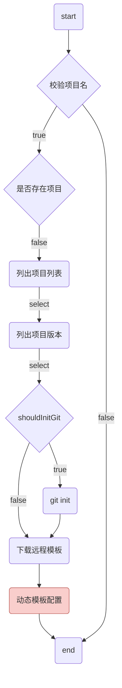

```mermaid
graph TD
classDef init fill:#fff,stroke: black;
classDef green fill:#D6E8D4,stroke: #85B469;
classDef pink fill:#F9CECC,stroke: #B95752;
classDef blue fill:#DBE8FC,stroke: #7A99C7;
A0(start) --> A{校验项目名}  --> |true|C{是否存在项目} --> |false|E(列出项目列表)  -->  |select|F(列出项目版本) --> |select|H{shouldInitGit}  -->  |false|I(下载远程模板)  -->  J(动态模板配置)  --> Z

A --> |false|Z(end)
H --> |true|H1(git init)  -->  I

class J pink
```

