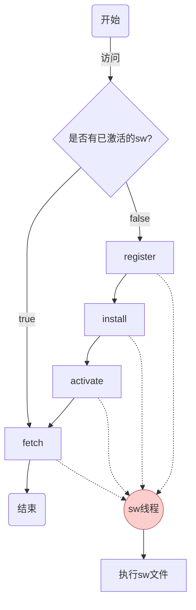
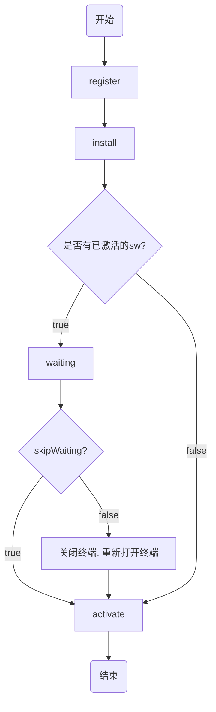

# Worker分类

## Dedicated Worker

专用线程，只能被一个页面所使用

## Shared Worker

共享线程，可以被多个页面共享

## Service Worker

相当于浏览器和`Web`应用间的代理服务器，它可以拦截网络请求、允许访问推送通知和后台同步`API`，这就使得可以用来做离线应用

# Web Worker

其实就是专用线程`Dedicated Worker`

`worker`的原理图


## 主线程

### 创建

创建`Worker`线程`new Worker(url, WorkerOptions)`即可，参数是个`url`，因为它不能读取本地文件，这个`url`指向的文件就是这个`Worker`线程所要执行的任务
因为接收`url`，所以我们可以用`URL.createObjectURL`创建一个，这样子我们可以内嵌`Worker`，如下：

参数说明：

+ url：`String`字符串，必须遵循同源政策
+ WorkerOptions：可选的选项
  + name：试想多个页面调用该`worker.js`，我们需要一个标识来判断哪个创建的该`worker`线程
  + type：用以指定`Worker`类型的 `String`值. 该值可以是`classic`或`module`。如果未指定，将使用默认值`classic`
  + credentials：用以指定`worker`凭证的`String`值。该值可以是`omit、same-origin、include`。如果未指定，或者`type`是`classic`，将使用默认值`omit`(不要求凭证)

```js
const fn = `
    console.log('Im worker!')
`
const url = URL.createObjectURL(new Blob([fn]))
const worker = new Worker(url, {
  	name: 'worker name'
})
```
> `Worker`的创建是异步的，是不会阻塞主线程的代码执行
>
> `worker`线程内还可以创建`worker`，不过得看浏览器是否支持

### 基本用法

主进程往子进程发消息用`postMessage`，它可可以发送任意数据类型
```js
worker.postMessage('To worker data!')
```
通过`onmessage`来监听来自子线程的消息
```js
worker.onmessage = event => {
    console.log('From worker: ', event.data)
}
```
通过`onmessageerror`来监听数据无法序列化成字符串
```js
worker.onmessageerror = error => {
    console.log(error)
}
```
通过`terminate`来关掉这个子线程
```js
worker.terminate()
```
## Worker线程

### 上下文

通过`new Worker()`构造的`Worker`会运行在一个全新的`JS`环境中，`WorkerGlobalScope`就是该新的运行环境

属性列表：

|     console      |                             输出                             |
| :--------------: | :----------------------------------------------------------: |
|     location     |  |
|    navigator     |      `worker`关联的`WorkerNavigator`，`Navigator`的子集      |
|     onerror      |                           错误回调                           |
| onlanguagechange |                            自注释                            |
|    onoffline     |                            自注释                            |
|     ononline     |                            自注释                            |
|   performance    |    并非所有`Performance`属性和方法都可供`Web worker`使用     |
|       self       | 返回对`WorkerGlobalScope`(`DedicatedWorkerGlobalScope`)自身的引用 |

方法：

|     close     | 关闭`worker`线程 |
| :-----------: | :--------------: |
| importScripts |   加载`JS`脚本   |

### 基本用法

通过`onmessage、addEventListener('message', cb)`都可以接收来自主线程的消息

```js
self.addEventListener('message', ({ data }) => {
    console.log(data)
})

self.onmessage = ({ data }) => {
    console.log(data)
}
```

可以如此加载脚本

```js
importScripts('script1.js', 'script2.js', ...)
```
捕获错误，可以在主线程和`worker`线程捕获`worker`的错误
```js
// 主线程
worker.onerror = (e) => {
    console.log(e)
}

// worker线程
self.onerror = (e) => {
    console.log(e)
}
setTimeout(() => {
    importScripts('./js/js')
}, 1000)
```
关闭`worker`线程节省资源
```js
// 主线程
worker.terminate()

// worker线程
self.close()
```

## Transferable Objects

一般而言，`postMessage`传输数据是以拷贝的方式发送到`worker`，不过要是遇到大数据，比如一个几百兆的文件就不大靠谱了，这就有了`Transferable Objects`这项技术，就是直接转移数据控制权，当然为了防止俩个线程同时处理，数据发送之后原持有者不再持有该数据

```js
var ab = new ArrayBuffer(1)
worker.postMessage(ab, [ab])
```

# Shared Worker

这个其实和`Worker`差不多，只是因为它的特殊性就有了些许变化，以下列的是其特有的用法

一个应用有多个页面是个再也正常不过的功能了，而`Worker`是不能共享的，这就需要`Shared Worker`了

## 基本用法

如下可创建

```js
const worker = new SharedWorker(url)
```

因为是共享的，所以需要有法子来知道消息来源，这里有点像那个**为什么需要传输层？**，我们可以借用端口来标识

这样子一些常规操作改成如下所示

```js
worker.port.postMessage(123)
worker.port.addEventListener("message", function (evt) {
    console.log(evt)
})
```

还有的是端口必须连接初始化

```js
worker.port.start()
```

而在`worker`内部必须得有个`connect`事件来监听是否已经连接上了，还得提供这个关键的**端口**

```js
addEventListener("connect", function (evt) {
   var port = evt.ports[0]
   port.addEventListener("message", function (evt) {
      console.log(evt)
   })
   port.onmessage = (evt) => {
      console.log(evt)
   }
   port.start()
}) 
```

除此之外，`self`也是一样的用法，只是返回对`WorkerGlobalScope`(`SharedWorkerGlobalScope`)自身的引用

> `Worker`而言，创建的程序终止就意味着`Worker`也就终止了，但是`SharedWorker`不一样，只要有一个端口还连着它就还在

## 调试


# Service Worker

其实它的出现就是弥补了`Web Worker`的缺陷，`Web Worker`不能常驻，也就是做的事情的结果不能保存下来，但是`Service Worker`却可以，它可以常驻除非自行解除，而且可以持久的缓存处理的结果，这就可以做离线应用，所以它也是`PWA`的一项主要的技术

其实最早的时候有个`ApplicationCache`的技术可以解决离线访问的问题，也就是列一个`manifest.appcache`的清单，里面标明了要离线缓存的静态资源，不过有诸多缺点，可自行查阅

## 特点

出于安全考虑，`Service Worker`必须运行在`HTTPS`协议下，但是又处于调试考虑，本地的`127.0.0.1/localhost`也是可以的

它一旦被安装除非被主动解除不会一直存在，即使关闭了浏览器它也只是睡眠而已。基于此它可以进行推送消息、后台同步资源等

它可以拦截处理请求，可以持久化缓存静态资源且全部开发者可控

## 基本用法

### 注册安装
和其它`Worker`不一样，它不是`new`的，而是注册的
```js
// js/index.js
navigator.serviceWorker.register('./webworker.js', { scope: './' })
    .then((reg) => {
        console.log('success', reg)
    })
    .catch((err) => {
        console.log('fail', err)
    })
```
`register`接收俩参数：
+ 文件路径相对于当前`location.origin`，不是项目的路径，就像此例，假如`webworker.js`在`js`文件夹那么这么写是没用的，得`/js/webworker.js`才可以

+ 选填的配置项，`scope`比较重要，它控制该作用域下发起的`fetch`请求受当前`worker`控制。默认的`scope`和`path`有关，若是`/js/webworker.js`，`scope`就是`/js`，也就是`pach`的父级目录，我们可以修改`scope`，不过只能缩小，比如默认`/a/b`，那么可以`/a/b/c`，不能是`/d/e`

它返回`Promise`对象，我们可以知道是否注册成功，成功的话会返回一个`ServiceWorkerRegistration`实例，也就是`reg`

注册完之后浏览器会自动安装它，而且之后也会自动激活

在浏览器开发者工具也能看见该情况，当然要调试的话在[chrome://inspect/#service-workers](chrome://inspect/#service-workers)


> 当一个`sw`被初始注册时，页面在下次加载之前不会使用它，所以首次都不会监测到请求，即使你用定时器延时比如`appendChild `，但是你可以用`clients.claim()`方法来立即生效该`sw`，这样子可以立即控制这些页面

> 当`scope`不是`origin`，`navigator.serviceWorker.controller`为`null`

### 作用域污染

有时候会出现多个`worker`控制同一个页面的情况
```shell
├── a
│   ├── a.sw.js
│   └── index.html
├── b
│   └── index.html
└── root.sw.js
```
就像这个项目结构
```js
// /a/index.html
navigator.serviceWorker.register('./a.sw.js')

// /b/index.html
navigator.serviceWorker.register('../root.sw.js')
```
如此一来`/a/index.html`注册了个作用域是`/a`的`worker`，`/b/index.html`注册了个作用域是`/`的`worker`，也就是`/a/index.html`受到俩个`worker`控制

要是出现这种情况我们就得清除(`Unregister`)有问题的`worker`，就像手动点击上图的`Unregister`，不过这个不大现实，幸好我们有对应的`api`来`Unregister`

```js
// /a/index.html
navigator.serviceWorker.getRegistrations().then(regs => {
    regs.forEach(reg => {
        if (reg.scope !== `${location.origin}/a/`) {
            reg.unregister()
        }
    })
    navigator.serviceWorker.register('./a.sw.js')
})
```
我们可以遍历注册的`worker`，然后根据`scope`来注销掉对应的`worker`，最后重新注册当前作用域的`worker`即可（无惧重新注册，因为若是没什么变化是会自行跳过的）

### 终端

我们知道该`worker`被多个`client`共享


如图所示，我们打开的标签都在此显示

假设我们的`sw.js`如下

```js
addEventListener('fetch', event => {
    console.log('sw抓取请求: ' + event.request.url)
})
```

我们刷新其中一个页面，另外一个页面也会打印该文案，**这就是`sw`被终端共享**

上文有言，一个`sw`被注册激活之后，在下次加载之前不会生效，就像更新、初始化，我们可以用`clients.claim() 方法`使得其立即生效

> `clients.claim()`方法得看情况，比如有个网络定期加载资源的情况，若是使用该方法在`sw`更新的时候就会被新的`sw`接管，但是已经有了部分资源是被旧的`sw`已经处理了，这点得考虑到

### addEventListener

```js
addEventListener('install', (event) => {
  	// event ExtendableEvent
})
```

| addEventListener |                      说明                      |
| :--------------: | :--------------------------------------------: |
|     install      |                  监听安装成功                  |
|     activate     |                  监听激活成功                  |
|      fetch       |                    监听请求                    |
|     message      |                  监听收到消息                  |
|      error       |                    监听错误                    |
| controllerchange | 监听sw线程发生变化，比如新的sw跳过了等待切激活 |
|   updatefound    |             监听到sw diff有了更新              |
|   statechange    |              监听到sw状态有了变化              |

回调函数参数返回`ExtendableEvent`对象

### 工作流程



## 生命周期


一般而言，正常的生命周期如图所示，但是我们其实可控其中某些步骤

上文知道`sw`事件回调参数是`ExtendableEvent`对象，它有个[`waitUntil`方法](https://developer.mozilla.org/zh-CN/docs/Web/API/ExtendableEvent/waitUntil)，大致就是它接收一个`Promise`对象为参（假设`install`事件），若是`resolved`那么没什么，若是`rejected`那么`installing`就会变成`redundant`，也就是生命周期中断了

`ExtendableEvent.waitUntil()`其实是强行延长了生命周期，让本来`installed、activated`变成了`installing、activating`，然后让我们自行决定是否中断生命周期

### 状态

| installing |                     安装中                     |
| :--------: | :--------------------------------------------: |
| installed  |                    安装完毕                    |
| activating |                     激活中                     |
| activated  |                    激活完毕                    |
| redundant  | 丢弃的。比如安装、激活失败，或者已被新版本替换 |

## 注册设计

一般而言`Web`应用有`SPA、MPA`，也就是单页面、多页面应用，这个就有了区分

### SPA

对于单页面而言因为只有一个页面，所以只需要在入口页面注册一次即可，作用域通常就是默认的`\`，这样子可以控制整个应用的缓存

### MPA

对于多页面而言就得看情况了：

+ 注册单个：就像`/a、/b`俩页面业务逻辑差不多，那么在`/`注册一个就是了
+ 注册多个：那就是俩页面基本没什么关系，就是相互独立的，那么就得分别注册本作用域的，注册的`sw.js`最好也自行维护，这样子之后的升级维护也简单

## 更新和缓存
有个现成的解决方案[https://github.com/lavas-project/sw-register-webpack-plugin](https://github.com/lavas-project/sw-register-webpack-plugin)，以下就是基于对这个库的分析

默认情况下每24小时就会下载一次`Service Worker`，若是下载的文件是最新的那么就会被重新注册和安装，不过不会激活会进入等待状态，直到旧的`Worker`不再有页面使用，新的就会激活

对于开发而言我们可以勾选上图的`Update on reload`，这样子每次刷新都是最新的`worker`文件

值得注意的是`sw.js`是会受到`http`缓存策略控制的

这样子一来`Service Worker`的更新可就有问题了
比如我们有个`SPA`应用，作为`APPShell`的载体`index.html`肯定是会被缓存的，`sw.js`也是在`index.html`的`script`（内不内置无所谓）注册，而这个注册`sw.js`的脚本肯定也是被缓存好了的，我们在上线的时候改了`sw.js`内容，那么我们肯定希望上线之后应用用的是新的资源
按照预想的逻辑，我们访问页面之后流程如下：`sw.js diff`  ==>  重新安装`sw.js`  ==>  激活新的`sw`  ==>  第二次进入页面应用新的资源，那么问题来了：
+ `sw.js`会被缓存，也就是不能实时`diff`
+ 即使实时`diff`了，首次访问用的还是缓存，只有第二次进入页面才能使用新的资源
  

在解决此问题前我们先看下更新流程

### 更新流程



### `sw.js`的缓存

抛开`sw`不说，一般而言我们处理缓存文件要么就是改名字，比如`index.[hash].js`，可惜对于`sw`就不好用，应该说是个坑
假如我们一开始是`sw.1.js`，上新改成了`sw.2.js`，由于被缓存的`index.html`引用的必然是`sw.1.js`，那么可就没辙了，我们的`sw.2.js`就根本派不上用场，所以**我们之后的讨论就是`sw.js`不改名**

#### `Cache-control`

说来说去就是因为`sw.js`被`http`缓存了，我们只要设置`Cache-control: no-cache`即可，这样子一来必然可以实时`diff`，所消耗的无非是`sw.js`的实时请求，以及服务端对`sw.js`系列文件的路由添加
#### 前端版本控制

之前我们说了改名字不可行，但是我们可以新增版本号啊
```js
navigator.serviceWorker.register('./sw.js?v=20200717')
```
这样子肯定就没问题了？其实还是有个问题
```html
<!DOCTYPE html>
<html lang="en">
<head>
    <meta charset="UTF-8">
    <meta name="viewport" content="width=device-width, initial-scale=1.0">
    <title>Document</title>
</head>
<body>
    
</body>
<script>
    navigator.serviceWorker.register('./sw.js?v=20200717')
</script>
</html>
```
就像这段代码所示，我们这个`APPShell index.html`是被缓存了，即使你改了注册`sw.js`的版本号但是`index.html`里的注册代码没被更新也是白搭，所以这时候我们其实可以来个骚操作，如下
```html
<!DOCTYPE html>
<html lang="en">
<head>
    <meta charset="UTF-8">
    <meta name="viewport" content="width=device-width, initial-scale=1.0">
    <title>Document</title>
</head>
<body>
    
</body>
<script>
    window.onload = function () {
        const script = document.createElement('script')
        script.src = `/sw-register.js?v=${Date.now()}`
        document.body.appendChild(script)
    }
</script>
</html>
```
```js
// sw-register.js
navigator.serviceWorker.register('./sw.js?v=20200717')
```
这样子无论怎么样，这个`sw-register.js`必然是实时更新的，这样子我们只要更新`sw-register.js`，注册的`sw.js`自然也就是更新了

> 没有给`.register`直接加`Date.now()`是因为要是这么干，那么每次都是重新安装等待激活更新缓存，也就没什么意义了

### 实时生效缓存

这个是基于实时`sw.js diff`之上，也就是待激活状态，如下图所示


#### skipWaiting

这个方法就是专门用来跳过等待的，所以我只要在`sw.js`的监听`install`里调用该方法即可
```js
addEventListener('install', () => {
    self.skipWaiting()
})
```
不过呢还是有个小问题，就是假设我们当前用的是旧的`sw.js`，它负责整个应用的请求，但是在期间发现了新的`sw.js`，那么在这之后就是新的`sw.js`负责整个应用的请求了，也就是这个过程被分为了俩部分
新的`sw.js`激活会干掉老版本的预存储，那么要是这个`sw.js`修改了响应内容的话就可能导致应用出现不可预期的问题，而且这种情况也是很难调试的
#### skipWaiting + 刷新页面

这个是最简单不过的想法了，我们在上个方案的基础之上刷新页面不就可以了，不过这个有个小问题，就是要是更新了`sw.js`就会导致一次对于用户而言莫名其妙的更新，当然这也是可以解决的
```js
navigator.serviceWorker.addEventListener('controllerchange', () => {
    window.location.reload();
})
```
#### 控制转移

我们解决上面的问题其实很简单，我们把控制权交给用户即可，也就是出个`toast`提醒，或者给个按钮让用户自己决定是否更新

