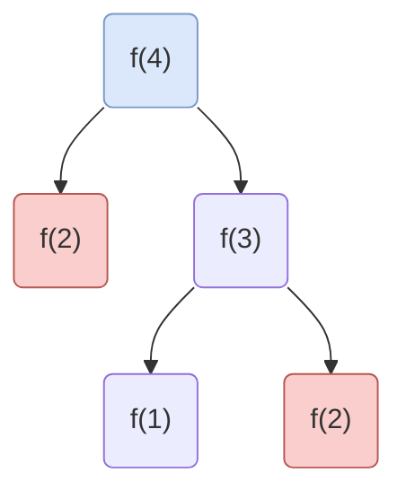

# 动态规划概述

动态规划一般都是求最值，比如最长递增子序列，它的解法也很简单就是**穷举**，当然是**聪明的穷举**，穷举出所有可能然后挑出最值

它和递归有点相像，递归是自顶向下，也就是从`f(n) ==>  f(0)`，动态规划是`f(0) ==> f(n)`。所以动态规划可以规避掉递归的爆栈

那么如何聪明的穷举呢？这就是我们要解决的问题

## 斐波那契数列

首先我们以此为例

```js
function fib (n) {
    if (n === 1 || n === 2) {
        return 1
    }
    return fib(n - 1) + fib(n - 2)
}
```

代码很简单，时间复杂度是O(2^n^)，但是这里可以优化的，因为它有重叠子问题

### 备忘录模式




如图所示，计算`f(4)`重复计算了`f(2)`，所以我们其实可以稍微修改下代码，保存下这个已经计算过得值即可

```js
function fib (n) {
    const memory = []
    function fn(n) {
        if (memory[n] != null) {
            return memory[n]
        }
        if (n === 1 || n === 2) {
            return 1
        }
        return memory[n] = fn(n - 1) + fib(n - 2)
    }

    return fn(n)
}
```

这样子就相当于只算上图右侧边支，所以时间复杂度为O(n)

> 递归算法的时间复杂度 = 子问题数 * 子问题所需时间
>
> 子问题数：递归树节点个数，所以是2^n^
>
> 子问题所需时间：递归算法里的操作数，本算法就`memory[n] = fn(n - 1) + fib(n - 2)`，所以是`1`

### 动态规划

我们知道动态规划是自底向上，就像此例，我们已知`f(1)、f(2)`，如此我们可以推导出`f(n)`

我们建立`dp table`，这个用于存储每一步的结果


如图所示，我们可以很简单的从`dp[1]、dp[2]`推导出之后的每一项，这个其实就是高中时候的数学归纳法
$$
dp(n) =
    \begin{cases}
    1,  & \text{$n$ = 1,  2} \\
    dp(n - 1)+dp[n - 2], & \text{n > 2} \\
    \end{cases}
$$

我们可以很容易的得到这个公式，这就是状态转移方程，`dp(n)`是状态`n`，它是由状态`n-1`和`n-2`转移而来，这就是状态转移，当然这个`n`就是状态，也就是该算法的唯一状态

根据此方程我们可以很简单的写出以下代码

```js
function fib (n) {
    const dp = [0, 1, 1]
    
    for (let i = 3; i <= n; i++) {
        dp[i] = dp[i - 1] + dp[i - 2]
    }
    return dp[n]
}
```

#### 状态压缩

看此代码我们其实可以发现每次循环只需要`i - 1、i - 2`状态，所以我们维持好这俩个状态即可，无需维护整个`dp table`，以此降低空间复杂度

```js
function fib (n) {
    let prev1 = 1, prev2 = 1, cur
    
    for (let i = 3; i <= n; i++) {
        cur = prev1 + prev2
        prev1 = prev2
        prev2 = cur
    }
    return cur
}
```


## [322. 零钱兑换](https://leetcode-cn.com/problems/coin-change/)

我们还是从递归解法说起，我们假设`coins = [1], amount = 11`，这时候你要是知道`amount = 10`的结果是`x`，那么你肯定知道`amount = 11`是`x + 1`，那么要是`coins = [1, 2]`，那么你还知道`amount = 9`的结果是`y`的话`amount = 11`是`y + 1`，所以循环遍历`coins`，每一次遍历都会求出减去每个零钱之后需要的个数（相当于状态转移），然后取最小值即可
也就是这个需要转移的状态必然是`amount`
$$
dp(n) =
    \begin{cases}
    -1,  & \text{$n$ < 0} \\
    0,  & \text{$n$ = 0} \\
    min \lbrace dp(n - coin) + 1 \; | \;coin \; \epsilon \; coins \rbrace, & \text{n > 0} \\
    \end{cases}
$$
状态转移方程如上

```js
function coinChange(coins, amount) {
    const memory = []
    function fn(amount) {
        if (memory[amount] != null) {
            return memory[amount]
        }
        if (amount === 0) {
            return 0
        }
        if (amount < 0) {
            return -1
        }
        let res = Number.MAX_VALUE
        for (let i = 0; i < coins.length; i++) {
            const coin = coins[i]
            const subRes = memory[amount - coin] = fn(amount - coin)
            if (subRes === -1) {
                continue
            }
            res = Math.min(res, subRes + 1)
        }
        return res === Number.MAX_VALUE ? -1 : res
    }
    return fn(amount)
}
```

代码如此所示

### 动态规划

按照上文的套路以及之前的分析我们可以确定：状态（amount）、`base case`（dp[0] = 0，有个隐藏的case，dp[coin] = 1），结合状态转移方程就可写出以下代码

```js
function coinChange(coins, amount) {
    const dp = new Array(amount + 1).fill(amount + 1)
    dp[0] = 0
    for (let i = 1; i < dp.length; i++) {
        for (let j = 0; j < coins.length; j++) {
            const coin = coins[j]
            if (i < coin) {
                continue
            }
            dp[i] = Math.min(dp[i], dp[i - coin] + 1)
        }
    }
    return dp[amount] > amount ? -1 : dp[amount]
}
```

值得注意的是`dp`除了第0项，其他的每一项都添值为`amount + 1`，这个其实是代表正无穷，毕竟即使一元硬币也只需要`amount`个就行了，这样子每次遍历就可以求取最小值，也就是把`dp[i - coin]`往已知的`dp[0]`靠

## 0-1背包问题

给你一个可以装`W`重量的背包以及`N`个宝物，每个宝物都有自己的重量和价值，分别为`wt[i]、val[i]`，现在让你敞开装，怎么装受益最大？

```js
function knapsack (W, N, wt, val) {
    const memory = new Array(W + 1).fill(0)
        .map(() => new Array(N + 1))
    function fn(W, N) {
        if (memory[W][N] != null) {
            return memory[W][N]
        }
        if (W === 0 || N === 0) {
            return 0
        } else {
            if (wt[N - 1] > W) {
                return memory[W][N - 1] = fn(W, N - 1)
            } else {
                const r1 = memory[W][N - 1] = fn(W, N - 1)
                const r2 = memory[W - wt[N - 1]][N - 1] = fn(W - wt[N - 1], N - 1)
                return Math.max(r1, val[N - 1] + r2)
            }
        }
    }
    return fn(W, N)
}
```

借着代码来分析下：

1. 首先确定下状态，很明显是`W、N`，因为背包容量和宝物数量是不定的，至于宝物的本身属性这个其实是给定的
2. 确定`Base Case`，也就是已知的初始值，很明显`W\N`为0的时候结果自然也是0
3. 如何推导？这个是最难的地方，我们就得先定义`DP Table`，假设`N = 3, W = 4, wt = [2, 1, 3], val = [4, 2, 3]`
| W\N  | 0    | 1    | 2    | 3    |
| :--: | ---- | ---- | ---- | ---- |
|  0   | 0    | 0    | 0    | 0    |
|  1   | 0    | 0    | 2    | 2    |
|  2   | 0    | 4    | 4    | 4    |
|  3   | 0    | 4    | 6    | 6    |
|  4   | 0    | 4    | 6    | 6    |

如表所示，`dp[W][N]`代表背包容量为`W`的情况下选`N`个宝物的收益（其实更可以理解为每个格子对应的宝物装还是不装，这也是0-1的来源），我们已知`dp[0][N]\dp[W][0]`结果是0，那么如何推导出`dp[W][N] ==> dp[0][N] | dp[W][0]`？

很明显得转移状态了，`dp[W][N]`代表有`N`种宝物，背包容量是`W`，针对第`N`种宝物我们`0\1`？

+ 很简单，判断下该宝物的重量和当前背包容量即可，要是不够装的话那么自然收益是`dp[W][N-1]`，也就是不考虑第`N`件宝物
+ 要是可以装的话那么就得判断下装了该宝物收益大还是没装的大（你可能觉得装了更大，这个其是因为你觉得这个是最后一次装填，但是这个可能是中间某一次，装还是不装影响后面的装填）。没装的话收益是`dp[W][N-1]`，装了的话当前收益就是装之前的收益`+`当前宝物价值，也就是`dp[W - wt[N-1]][N-1] + val[N-1]`

4. 由以上分析可得状态转移方程：
$$
dp(W, N) =
    \begin{cases}
    0,  & \text{$W$ = 0,  $N$ = 0} \\
    dp(W, N - 1),  & \text{wt[N - 1] > W} \\
    max(dp(W, N - 1), val[N-1] + dp(W - wt[N-1], N-1)),  & \text{wt[N - 1] <= W} \\
    \end{cases}
$$

### 动态规划

```js
function knapsack (W, N, wt, val) {
    const dp = new Array(W + 1).fill(0)
        .map((m, i) => {
            const arr = new Array(N + 1)
            if (i === 0) {
                arr.fill(0)
            } else {
                arr[0] = 0
            }
            return arr
        })
    
    for (let i = 1; i <= W; i++) {
        for (let j = 1; j <= N; j++) {
            if (wt[j - 1] > i) {
                dp[i][j] = dp[i][j - 1]
            } else {
                dp[i][j] = Math.max(dp[i][j - 1], val[j - 1] + dp[i - wt[j - 1]][j - 1])
            }
        }
    }
    return dp
}
```

## 总结

由此两栗子可知要是会了递归的话动态规划也会简单许多，毕竟是`f(n) <==> f(0)`的问题，会其中一个的话另外一个应该也会简单很多，而这个其实也是有套路的

1. 确认状态：也就是你需要的最值代表一个状态，你的供推导的初始值也是一种状态，初始值到你想要的最值必然是一系列的列表，而这个状态就是引起这个列表扩张的变量，就像斐波那契数列的`n`、零钱兑换的`amount`、0-1背包的`W、N`
2. 定义`DP Table`:  这个其实不难，不需要理解的话只要知道多少状态就是几维数组，其实理解也不难，我们这前俩个栗子都是只有一个状态，就像零钱兑换，`dp[i]`就是目标金额是`i`的话至少需要的硬币数，0-1背包问题就有俩个状态，`dp`就是个二维数组。**对于字符串，一般一般而言我们会拓展一行（列）空字符串，它作为`Base Case`**
3. 确定`Base Case`，这个就是一些已知的值，也就是让递归停止的值。一般而言都是状态为0的时候我们可以确定的值
4. 状态转移，也就是如何推导。
   + 对于递归而言就是假设已知`dp[i][j]...`，那么`dp[i-x][j-x]...`是多少，直到`Base Case`，是为自顶向下
   + 对于动态规划而言就是通过`Base Case`来推导出`dp[i][j]...`，是为自底向上

5. 根据以上分析得到最终的状态转移方程，也就是规律的数学化

> 有些情况有`fn(0) <==> fn(n)`可以双向推导，不过这仅限于递归，对于递归而言只要有法子让它停止继续递归即可，但是对于动态规划而言得知道具体的`f(n)`的值，这样子才可以推导
>
> 可以参见正则表达式这个例子

# [1143. 最长公共子序列](https://leetcode-cn.com/problems/longest-common-subsequence/)

1. 首先确定状态，很明显就是`text1、text2`，因为最值就是因为这俩个变化而变化
2. 定义`DP Table`，`dp[i][j]`就是长度为`i`的`text1`和长度为`j`的`text2`的公共子序列最长长度

| t1\t2 |  ''  |  a   |  c   |  e   |
| :---: | :--: | :--: | :--: | :--: |
|  ''   |  0   |  0   |  0   |  0   |
|   a   |  0   |  1   |  1   |  1   |
|   b   |  0   |  1   |  1   |  1   |
|   c   |  0   |  1   |  2   |  2   |
|   d   |  0   |  1   |  2   |  2   |
|   e   |  0   |  1   |  2   |  3   |

3. 确定`Base Case`，这个就是`text1\text2`为空的话都为0，也就是`dp[0][j] = dp[i][0] = 0`

4. 状态转移：也就是算`dp[i][j]`等于多少

   + 若是`text1[i - 1] === text2[j - 1]`：这俩个相等的话如`dp[5][3]`，这必然是`dp[i][j] = 1 + dp[i - 1][j -  1]`，就是相当于舍弃掉这俩个做的对比结果加一
   + 若是不相等的话，那么说明这俩个字符至少有一个字符不是这个公共子序列，那么就是分别舍弃一个然后得到的结果取最大值，即`dp[i][j] = Math.max(dp[i - 1][j], dp[i][j - 1])

5. 根据分析可得状态转移方程：
$$
dp(i, j) =
    \begin{cases}
    0,  & \text{$i$ = 0  |  j = 0} \\
    dp(i-1,\;j-1)\;+\;1,  & \text{$text1[i-1]\;$ === $\;text2[j-1]$} \\
    max(dp(i-1,\;j), \;\; dp(i,\;j-1)),  & \text{$text1[i-1]\;$ !== $\;stext2[j-1]$} \\
    \end{cases}
$$

据此可以写出以下代码

递归：

```js
function longestCommonSubsequence(text1, text2) {
    text1 = text1.split('')
    text2 = text2.split('')
    const t1Len = text1.length
    const t2Len = text2.length
    const memory = new Array(t1Len + 1).fill(0)
        .map(() => new Array(t2Len + 1))
    function fn (i, j) {
        if (memory[i][j] != null) {
            return memory[i][j]
        }
        if (i === 0 || j === 0) {
            return 0
        }
        if (text1[i - 1] === text2[j - 1]) {
            memory[i - 1][j - 1] = fn(i - 1, j - 1)
            return memory[i - 1][j - 1] + 1
        } else {
            const r1 = memory[i - 1][j] = fn(i - 1, j)
            const r2 = memory[i][j - 1] = fn(i, j - 1)
            return Math.max(r1, r2)
        }
    }
    return fn(t1Len, t2Len)
}
```

没什么别的，注意下`memory`只保存`fn`的执行结果就是了

动态规划：

```js
function longestCommonSubsequence(text1, text2) {
    text1 = text1.split('')
    text2 = text2.split('')
    const t1Len = text1.length
    const t2Len = text2.length
    const dp = new Array(t1Len + 1).fill(0)
        .map((m, i) => {
            const arr = new Array(t2Len + 1)
            if (i === 0) {
                arr.fill(0)
            }
            arr[0] = 0
            return arr
        })

    for (let i = 1; i <= t1Len; i++) {
        for (let j = 1; j <= t2Len; j++) {
            if (text1[i - 1] === text2[j - 1]) {
                dp[i][j] = dp[i - 1][j - 1] + 1
            } else {
                dp[i][j] = Math.max(dp[i][j - 1], dp[i - 1][j])
            }
        }
    }
    return dp[t1Len][t2Len]
}
```

这个注意下`dp`初始化即可，状态压缩就懒得压了

# [10. 正则表达式匹配](https://leetcode-cn.com/problems/regular-expression-matching/)

1. 首先确认状态，这个很明显就是`s、p`，随着它们俩的变化

2. 定义`DP Table`，用于辅助推导

   | s\p  |  ''  |  c   |  *   |  a   |  *   |  b   |
   | :--: | :--: | :--: | :--: | :--: | :--: | :--: |
   |  ''  |  1   |  0   |  1   |  0   |  1   |  0   |
   |  a   |  0   |  0   |  0   |  1   |  1   |  0   |
   |  b   |  0   |  0   |  0   |  0   |  1   |  0   |
   |  b   |  0   |  0   |  0   |  0   |  0   |  1   |

   如表所示，就是`dp[i][j]`代表长度为`i`的`s`和长度为`j`的`p`的匹配结果
   
 3. `Base Case`这个和`LCS`这个例子有点不一样，我们知道`LCS`的`dp[0][j]、dp[i][j]`是`0`，但此例`dp[0][j]`其实还是得计算的，这个就不能简单地作为`Base Case`了，不过**这个有点特殊，因为正则匹配匹配上的必然是`s\p`俩个同时遍历完毕**，所以这是个隐藏条件

4. 状态转移，这个可以分俩种，一种是从左往右，一种是从右往左，首先说下情况，就是`*`，对于一个字符而言，若是紧接着`*`那么这个字符是可以重复`N`次的，所以它和`*`可以看做一个整体

   + 左往右：**`p`遍历完了，`s`也得遍历完，也就是`j === pLen  <==>  i === sLen`**

     + `p`当前字符后接`*`：这样子可以分为俩种情况，一则该字符重复`0`次，也就是`s`和去掉该字符和紧接的`*`俩字符的`p俩者匹配

       

       或者就是重复`N`次，前提是`s`的第一个值和`p`的第一个值一样，那么去掉`s`的当前值继续匹配即可

       

     + 当前字符后不接`*`：这个就只要考虑`p`当前字符和`s`当前字符是否匹配即可，匹配的话就相当于把这俩个忽略，看其余的字符匹配情况就是了，这样子就把问题降小了

       

   + 右往左：**`p`遍历完了，`s`也得遍历完，也就是`j === 0  <==>  i === 0`**

     + `p`当前字符是`*`，那么就得考虑前个字符情况了，因为俩个是一体的，若是重复零次

       

       若是重复`N`次，前提是`s`的最后一个值和`p`的倒数第二个值一样，那么去掉`s`的当前值继续匹配即可

       

5. 状态转移方程

+ `dp(0, 0)`趋近`dp(i, j)`

$$
dp(i, j) =
    \begin{cases}
    i === sLen,  & \text {$j === pLen$} \\
    dp(i, j+2) \;\;or\;\; match(i,j)\;\;and\;\;dp(i+1,j) ,  & \text{$p[j+1]$ = '*'} \\
    dp(i+1, j+1) \;\;and\;\;match(i,j),  & \text otherwise\\
    \end{cases}
$$


+ `dp(i, j)`趋近`dp(0, 0)`，适用于动态规划

$$
dp(i,j) =
    \begin{cases}
    i === 0,  & \text{$j$ = 0} \\
    dp(i, j - 2)\;\;or\;\;match(i - 1, j - 2), & \text{ j >= 2 && p[j - 1] === '*' } \\
    match(i - 1, j - 1)\;\;and\;\;dp(i-1, j-1), & \text{otherwise}\\ 
    \end{cases}
$$

## 代码实现

### dp(0, 0) ==> dp(i, j)

#### 递归

```js
var isMatch = function (s, p) {
    if (!p) {
        return !s
    }

    const first = s && (p[0] === s[0] || p[0] === '.')

    if (p.length >= 2 && p[1] === '*') {
        return isMatch(s, p.slice(2)) || (first && isMatch(s.slice(1), p))
    } else {
        return first && isMatch(s.slice(1), p.slice(1))
    }
}
// 备忘录版
var isMatch = function (s, p) {
    const sLen = s.length
    const pLen = p.length
    const memory = new Array(sLen + 1).fill(null)
        .map(_ => new Array(pLen + 1))

    function match(i, j) {
        return s[i] === p[j] || p[j] === '.'
    }

    function fn(i, j) {
        if (j === pLen) {
            return i === sLen
        }
        if (memory[i][j] != null) {
            return memory[i][j]
        }
        const first = i < sLen && match(i, j)
        if (pLen - j >= 2 && p[j + 1] === '*') {
            return memory[i][j] = fn(i, j + 2) || (first && fn(i + 1, j))
        } else {
            return memory[i][j] = first && fn(i + 1, j + 1)
        }
    }
    return fn(0, 0)
}
```

这个就是从左往右得出值，注意下标不要越界即可，**这里就没有拓展空字符串的行列**

#### 动态规划

```js
var isMatch = function (s, p) {
    const sLen = s.length
    const pLen = p.length
    const dp = new Array(sLen + 1).fill(null)
        .map(_ => {
            const arr = new Array(pLen + 1)
            arr[0] = false
            return arr
        })
    dp[0][0] = true

    function match(i, j) {
        return i >= 0 && (s[i] === p[j] || p[j] === '.')
    }

    for (let i = 0; i <= sLen; i++) {
        for (let j = 1; j <= pLen; j++) {
            if (p[j - 1] === '*') {
                dp[i][j] = dp[i][j - 2] || match(i - 1, j - 2) && dp[i - 1][j]
            } else {
                dp[i][j] = match(i - 1, j - 1) && dp[i - 1][j - 1]
            }
        }
    }
    return dp[sLen][pLen]
}
```

动态规划就很不一样，就是从小到大不能从大到小，因为它有个`Base Case`，一般而言你只知道`dp[0][j]、dp[i][j]`的值，从已知趋向于`dp[i][j]`，你不大可能知道`dp[i][j]`，当然知道的话搞不定也可以反向推导求得`dp[0][0]`

### dp(i, j) ==> dp(0, 0)

#### 递归

```js
var isMatch = function (s, p) {
    if (!p) {
        return !s
    }
    const sLen = s.length
    const pLen = p.length

    if (p.length >= 2 && p[pLen - 1] === '*') {
        const last = s && (p[pLen - 2] === s[sLen - 1] || p[pLen - 2] === '.')
        return isMatch(s, p.slice(0, -2)) || (last && isMatch(s.slice(0, -1), p))
    } else {
        const last = s && (p[pLen - 1] === s[sLen - 1] || p[pLen - 1] === '.')
        return last && isMatch(s.slice(0, -1), p.slice(0, -1))
    }
}
// 备忘录
var isMatch = function (s, p) {
    const sLen = s.length
    const pLen = p.length
    const memory = new Array(sLen + 1).fill(null)
        .map(_ => new Array(pLen + 1))

    function match(i, j) {
        return i >= 0 && (s[i] === p[j] || p[j] === '.')
    }

    function fn(i, j) {
        if (j === 0) {
            return i === 0
        }
        if (memory[i][j] != null) {
            return memory[i][j]
        }
        if (j >= 2 && p[j - 1] === '*') {
            return memory[i][j] = fn(i, j - 2) || (match(i - 1, j - 2) && fn(i - 1, j))
        } else {
            return memory[i][j] = match(i - 1, j - 1) && fn(i - 1, j - 1)
        }
    }
    return fn(sLen, pLen)
}
```

套路其实都是一样的，注意下标即可


# [72. 编辑距离](https://leetcode-cn.com/problems/edit-distance/)


1. 状态自然就是`word1、word2`

2. `DP Table`

| i\j  |      |  0   |  1   |  2   |  3   |
| :--: | :--: | :--: | :--: | :--: | :--: |
|      | s\p  |  ''  |  r   |  o   |  s   |
|  0   |  ''  |  0   |  1   |  2   |  3   |
|  1   |  h   |  1   |  1   |  2   |  3   |
|  2   |  o   |  2   |  2   |  1   |  2   |
|  3   |  r   |  3   |  2   |  2   |  2   |
|  4   |  s   |  4   |  3   |  3   |  2   |
|  5   |  e   |  5   |  4   |  4   |  3   |

3. `Base Case`：`dp[0][j] = j、dp[i][0] = i`

4. 状态转移
   
   
   
   如图所示，我们可以分为四种情况，这四种操作都可以达到目标效果：

   + 替换：就像`hr\ro`，把`r`替换`o`的话就相当于`h\r`的结果`+1`
   + 跳过：就像`ho\ro`，`o`和`o`相等，也就是这个不用管，结果就相当于`h\r`
   + 添加：就像`h\hr`，添加字符`r`就行了，也就是`h\h`结果`+1`
   + 删除：就像`hr\h`，删除字符`r`，也就是`h\h`结果`+1`
   
5. 状态转移方程
$$
dp[i][j] =
    \begin{cases}
    j,  & \text{$i$ = 0} \\
    i,  & \text{$j$ = 0} \\
    1+min(dp(i-1, j-1) - 1,\;\;dp(i-1, j),\;\;dp(i, j-1)),  & \text{$w1[i - 1]$ === $w2[j - 1]$} \\
    1+min(dp(i-1, j-1),\;\;dp(i-1, j),\;\;dp(i, j-1)),  & \text{$w1[i - 1]$ !== $w2[j - 1]$} \\
    \end{cases}
$$

```js
var minDistance = function (word1, word2) {
    const w1Len = word1.length
    const w2Len = word2.length
    const dp = new Array(w1Len + 1).fill(null)
        .map((_, i) => {
            const arr = new Array(w2Len + 1).fill(undefined)
            if (i === 0) {
                arr.map((itm, j) => {
                    arr[j] = j
                })
            } else {
                arr[0] = i
            }
            return arr
        })

    for (let i = 1; i <= w1Len; i++) {
        for (let j = 1; j <= w2Len; j++) {
            if (word1[i - 1] === word2[j - 1]) {
                dp[i][j] = 1 + Math.min(dp[i - 1][j - 1] - 1, dp[i - 1][j], dp[i][j - 1])
            } else {
                dp[i][j] = 1 + Math.min(dp[i - 1][j - 1], dp[i - 1][j], dp[i][j - 1])
            }
        }
    }
    return dp[w1Len][w2Len]
};
```


$$
dp(n) =
    \begin{cases}
    nums[0],  & \text{$n$ = 0} \\
    max(nums[n], & dp[n - 1] + nums[n])
    \end{cases}
$$


|      |      |  0   |  1   |  2   |  3   |  4   |  5   |  6   |  7   |  8   | 9    |
| :--: | :--: | :--: | :--: | :--: | :--: | :--: | :--: | :--: | :--: | :--: | ---- |
|      | s\p  |  ''  |  r   |  o   |  s   |      |      |      |      |      |      |
|  0   |  ''  |  0   |  1   |  2   |  3   |      |      |      |      |      |      |
|  1   |  h   |  1   |  1   |  2   |  3   |      |      |      |      |      |      |
|  2   |  o   |  2   |  2   |  1   |  2   |      |      |      |      |      |      |
|  3   |  r   |  3   |  3   |  2   |  2   |      |      |      |      |      |      |
|  4   |  s   |  4   |  3   |  3   |  2   |      |      |      |      |      |      |
|  5   |  e   |  5   |  4   |  4   |  3   |      |      |      |      |      |      |
|  6   |      |      |      |      |      |      |      |      |      |      |      |
|  7   |      |      |      |      |      |      |      |      |      |      |      |
|  8   |      |      |      |      |      |      |      |      |      |      |      |

```powershell
N = 3, W = 4
wt = [2, 1, 3]
val = [4, 2, 3]
```

$$
dp[i][j] =
    \begin{cases}
    nums[0],  & \text{$n$ = 0} \\
    max(nums[n], & dp[n - 1] + nums[n])
    \end{cases}
$$

